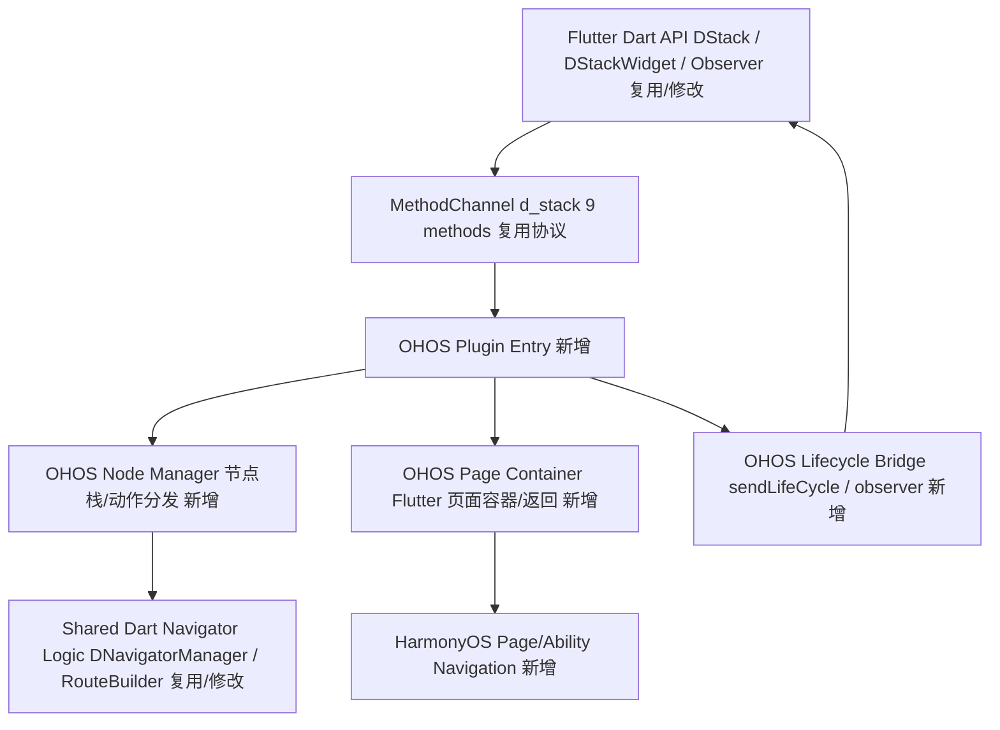

# d_stack 鸿蒙适配需求规格（PRD）

## 1. 插件概述

### 1.1 基本信息

| 项目 | 内容 |
|------|------|
| 插件名称 | d_stack |
| 版本 | 1.3.4+3-nullsafety |
| 仓库地址 | https://github.com/tal-tech/d_stack |
| 许可证 | MIT |
| 已支持平台 | android, ios |

### 1.2 插件简介

d_stack 是一个面向 Flutter 混合开发的页面栈管理插件，用于解决 Flutter 页面与原生页面之间互相跳转、统一路由、生命周期同步和数据回传问题。插件以“节点”为核心抽象，将 Flutter 页面与 Native 页面都记录为节点，通过 MethodChannel 在 Dart 与原生端之间同步栈变化。

插件典型场景包括原生工程嵌入 Flutter 页面、Flutter 工程跳转原生页面、跨栈返回、返回到指定页面、页面参数传递、生命周期回调和页面操作观察。当前实现支持 Android 与 iOS，未包含 Web、桌面、PlatformView、Texture 或 FFI 能力。

### 1.3 目标用户与使用场景

- 已有 Android/iOS 原生 App 希望逐步接入 Flutter 页面，并保持原有原生导航栈。
- Flutter 与 Native 页面需要互相 push、present、pop、popTo、dismiss 或回到根页面。
- 业务需要统一监听页面生命周期、应用前后台状态和页面节点操作。
- 页面跳转需要携带 `Map` 参数并在返回时回传结果。
- Flutter 页面需要自定义转场动画、透明转场或 iOS 风格侧滑返回。

### 1.4 适配复杂度评估

| 指标 | 数值 | 说明 |
|------|------|------|
| 复杂度评分 | 13 | 映射：0-2=low / 3-7=medium / 8-14=high / ≥15=very_high |
| 复杂度等级 | high | MethodChannel 契约中等，但原生栈管理代码量较大 |
| 适配建议 | proceed_with_caution | 可适配，但需谨慎处理页面容器、生命周期和节点栈同步 |

**风险项**：

| 风险描述 | 严重程度 | 缓解措施 |
|---------|---------|---------|
| Android 原生端依赖 Intent/startActivity 打开 Flutter 容器页面，鸿蒙侧页面跳转模型不同 | medium | 后续 planning 阶段需将 Activity/Intent 容器跳转语义映射为鸿蒙应用内页面/Ability 跳转模型，并保持节点栈同步 |
| iOS 与 Android 原生实现不完全对齐：`sendHomePageRoute` 仅 iOS 原生端实现，`getPlatformVersion` 仅原生端保留 | low | planning 阶段按交叉验证结果决策鸿蒙端兼容方法 |
| 原生代码量超过 3000 行且包含 Flutter embedding Activity 封装 | medium | 分阶段实现 MethodChannel 契约、节点管理和容器生命周期，并增加 example 行为验证 |

### 1.5 鸿蒙生态规则提示

| 规则类别 | 要求级别 | 涉及能力/Kit | 触发依据 | 约束说明 |
|---------|---------|-------------|----------|----------|
| deep_link / 跳转 | suggested | App Linking / 应用内跳转能力 | Android 端 `DStack.java:166`、`DStack.java:204` 构造 `Intent` 并调用 `context.startActivity(intent)` 打开 Flutter 容器页面 | 本插件保持混合栈语义；涉及跨应用或外部链接时优先评估 App Linking，应用内容器跳转需遵循鸿蒙页面/Ability 跳转模型 |

本插件不涉及 HarmonyOS 受限权限替代：未声明 Android 权限，未发现通讯录、媒体库、剪贴板、悬浮窗等受限权限能力。

---

## 2. 功能需求总览

### 2.1 功能模块划分

| 模块编号 | 功能模块 | 描述 | API 数 | 验收标准（AC） | 优先级 |
|---------|---------|---------|--------|--------------|--------|
| F-01 | 初始化与路由注册 | 创建 `DStack` 单例、注册页面 builder、接入 Navigator key/observer 与首页容器 | 7 | 1. 能完成 `DStack.instance.register` 注册<br>2. `DStackWidget` 能设置首页和首页路由<br>3. Navigator 能挂载 `navigatorKey` 与 `dStackNavigatorObserver` | P0 |
| F-02 | 混合页面跳转与节点同步 | 支持 Flutter/Native 页面 push、present、replace、pushAndRemoveUntil、animatedFlutterPage 和自定义动画进入 | 14 | 1. Flutter 页面跳转后节点同步到原生<br>2. Native 页面跳转请求能通过 Channel 到达原生路由<br>3. 自定义转场配置生效 | P0 |
| F-03 | 返回、移除与结果回传 | 支持 pop、maybePop、popTo、popSkip、dismiss、popToRoot 和 Flutter 节点移除同步 | 10 | 1. 返回动作能同步节点变化<br>2. `result/params` 能随返回传递<br>3. 手势返回能避免重复移除节点 | P0 |
| F-04 | 生命周期与节点观察 | 通过 observer 暴露应用前后台、页面出现和节点操作事件 | 11 | 1. 原生生命周期能触发 Dart observer<br>2. 节点操作能传递给 `DNodeObserver`<br>3. 页面模型字段完整 | P1 |
| F-05 | 节点模型与数据序列化 | 使用 `DNodeEntity`、`DNode`、`DStackNode`、`PageModel` 描述栈节点、页面类型、动作和参数 | 8 | 1. 节点 Map 能与对象互转<br>2. 节点列表可从原生读取<br>3. 页面类型 native/flutter 能正确解析 | P0 |
| F-06 | 转场与手势返回 | 提供 `TransitionType`、`DStackPageRouteBuilder`、`DStackPopResult` 与 iOS 风格侧滑返回 | 12 | 1. 支持内置转场类型<br>2. `popGesture` 在 iOS 主题下启用<br>3. 非 void 回调语义清晰 | P1 |
| F-07 | Channel 兼容契约 | 保持 `d_stack` MethodChannel 名称和 9 个方法契约逐字一致 | 9 | 1. Channel 名称精确为 `d_stack`<br>2. 所有方法名和参数字段保持兼容<br>3. 三端差异在实现中有明确决策 | P0 |

### 2.2 功能依赖关系

```text
F-01 初始化与路由注册
├─ F-02 混合页面跳转与节点同步
│  ├─ F-05 节点模型与数据序列化
│  └─ F-07 Channel 兼容契约
├─ F-03 返回、移除与结果回传
│  ├─ F-05 节点模型与数据序列化
│  └─ F-07 Channel 兼容契约
├─ F-04 生命周期与节点观察
│  └─ F-07 Channel 兼容契约
└─ F-06 转场与手势返回
   └─ F-03 返回、移除与结果回传
```

---

## 3. 公开 API 规格

> 本节按 app-facing 入口和可直接 import 的 `lib/` 公共子路径列出公开 API。`package:d_stack/d_stack.dart` 未导出子路径，但 example 直接使用 `observer/life_cycle_observer.dart` 与 `widget/home_widget.dart`，因此这些非 `lib/src/` 符号也视为公开可用 API。

### 3.1 枚举与顶层类型

| API | 类型 | 所属模块 | 规格 | 源码位置 |
|-----|------|----------|------|----------|
| `PageType` | enum | F-05 | 页面类型，枚举值：`native`、`flutter` | `lib/d_stack.dart:18` |
| `TransitionType` | enum | F-06 | 转场类型，枚举值：`native`、`nativeModal`、`inFromLeft`、`inFromTop`、`inFromRight`、`inFromBottom`、`fadeIn`、`custom`、`material`、`materialFullScreenDialog`、`cupertino`、`cupertinoFullScreenDialog`、`fadeOpaque`、`fadeAndScale`、`none` | `lib/d_stack.dart:23` |
| `DLifeCycleState` | enum | F-04 | 生命周期状态，枚举值：`create`、`foreground`、`background` | `lib/observer/life_cycle_observer.dart:12` |
| `DStackWidgetBuilder` | typedef | F-01 | `WidgetBuilder Function(Map? params)`，路由名到页面 builder 的注册类型 | `lib/d_stack.dart:44` |
| `AnimatedPageBuilder` | typedef | F-06 | 自定义 `PageRouteBuilder` 的页面构造回调 | `lib/d_stack.dart:45` |
| `PushAnimationPageBuilder` | typedef | F-06 | 自定义 `DStackPageRouteBuilder` 转场动画回调 | `lib/d_stack.dart:51` |
| `defaultPushDuration` | top-level const | F-06 | 默认 push 转场时长，`Duration(milliseconds: 300)` | `lib/d_stack.dart:41` |
| `defaultPopDuration` | top-level const | F-06 | 默认 pop 转场时长，`Duration(milliseconds: 250)` | `lib/d_stack.dart:42` |

### 3.2 `DStack`

| API | 所属模块 | 方法签名/属性 | 功能描述 | Channel/实现 | 源码位置 |
|-----|----------|---------------|----------|--------------|----------|
| `DStack.instance` | F-01 | `static DStack get instance` | 创建 `MethodChannel("d_stack")` 并初始化 `DChannel`，返回单例 | MethodChannel `d_stack` | `lib/d_stack.dart:61` |
| `channel` | F-07 | `DChannel? get channel` | 返回当前 `DChannel` 实例，供内部发送节点消息 | MethodChannel 封装 | `lib/d_stack.dart:67` |
| `homeRoute` | F-01 | `String? get homeRoute` | 获取首页路由名 | 纯 Dart 状态 | `lib/d_stack.dart:71` |
| `homePageRoute` | F-01 | `set homePageRoute(String? route)` | 设置首页路由；非空时调用 `sendHomePageRoute` 通知原生端 | `sendHomePageRoute` | `lib/d_stack.dart:73` |
| `navigatorKey` | F-01 | `GlobalKey<NavigatorState>` | 业务 `MaterialApp.navigatorKey` 需使用该 key，以便插件控制 Flutter 导航栈 | Flutter Navigator | `lib/d_stack.dart:81` |
| `dStackNavigatorObserver` | F-01/F-03 | `DStackNavigatorObserver` | 业务 `MaterialApp.navigatorObservers` 需挂载，用于监听 push/pop/手势返回并同步节点 | Flutter NavigatorObserver | `lib/d_stack.dart:84` |
| `dLifeCycleObserver` | F-04 | `DLifeCycleObserver?` | 接收应用与页面生命周期事件 | `sendLifeCycle` | `lib/d_stack.dart:88` |
| `dNodeObserver` | F-04 | `DNodeObserver?` | 接收原生端节点操作事件 | `sendOperationNodeToFlutter` | `lib/d_stack.dart:91` |
| `register` | F-01/F-04 | `void register({Map<String, DStackWidgetBuilder>? builders, DLifeCycleObserver? observer, DNodeObserver? nodeObserver})` | 注册路由 builder、生命周期 observer 和节点 observer | 纯 Dart 注册 | `lib/d_stack.dart:99` |
| `pageBuilder` | F-01 | `DStackWidgetBuilder pageBuilder(String? pageName)` | 根据路由名获取页面 builder；不存在时抛出 `Exception('not in the PageRoute')` | 纯 Dart 查找 | `lib/d_stack.dart:112` |
| `nodeList` | F-05/F-07 | `Future<List<DStackNode>> nodeList()` | 从原生端读取当前节点列表 | `sendNodeList` | `lib/d_stack.dart:122` |
| `push` | F-02 | `static Future push(String routeName, PageType pageType, {Map? params, bool maintainState = true, bool animated = true})` | 推入 Flutter 或 Native 页面；Flutter 页面直接 push Route，Native 页面只同步节点等待原生处理 | `sendNodeToNative` | `lib/d_stack.dart:129` |
| `present` | F-02 | `static Future present(String routeName, PageType pageType, {Map? params, bool maintainState = true, bool animated = true})` | 以 modal/fullscreenDialog 语义打开页面 | `sendNodeToNative` | `lib/d_stack.dart:137` |
| `animatedFlutterPage` | F-02/F-06 | `static Future animatedFlutterPage(String routeName, {Map? params, TransitionType? transition, Duration transitionDuration = const Duration(milliseconds: 250), RouteTransitionsBuilder? transitionsBuilder, bool replace = false, bool clearStack = false})` | 使用内置或自定义 `TransitionType` 打开 Flutter 页面，可替换或清栈 | `sendNodeToNative` | `lib/d_stack.dart:143` |
| `pushWithAnimation` | F-02/F-06 | `static Future pushWithAnimation(String routeName, PageType pageType, PushAnimationPageBuilder animationBuilder, {Map? params, bool replace = false, bool popGesture = false, Duration pushDuration = defaultPushDuration, Duration popDuration = defaultPopDuration})` | 使用自定义动画 builder 进入页面；`popGesture` 在 iOS 主题下启用侧滑返回 | `sendNodeToNative` | `lib/d_stack.dart:169` |
| `pushBuild` | F-02 | `static Future pushBuild(String routeName, PageType pageType, WidgetBuilder builder, {Map? params, bool maintainState = true, bool fullscreenDialog = false, bool animated = true})` | 不通过注册表，直接使用传入 builder 打开 Flutter 页面 | `sendNodeToNative` | `lib/d_stack.dart:191` |
| `replace` | F-02 | `static Future replace(String routeName, PageType pageType, {Map? params, bool maintainState = true, bool fullscreenDialog = false, bool animated = true, bool homePage = false})` | 替换当前 Flutter 页面；Native 页面返回 `Future.error('not flutter page')` | `sendNodeToNative` | `lib/d_stack.dart:206` |
| `pushAndRemoveUntil` | F-02/F-03 | `static pushAndRemoveUntil(String routeName, PageType pageType, {Map? params, bool maintainState = true, bool fullscreenDialog = false, bool animated = true, bool homePage = false})` | 打开指定页面并清除剩余页面 | `sendNodeToNative` | `lib/d_stack.dart:224` |
| `pop` | F-03 | `static void pop({Map? result, bool animated = true})` | 返回一页，可携带结果 Map | `sendNodeToNative` | `lib/d_stack.dart:244` |
| `maybePop` | F-03 | `static Future<bool> maybePop({Map? result, bool animated = true})` | 先检查当前 Route `willPop`，允许时执行 `pop`；返回是否处理 | `sendNodeToNative` | `lib/d_stack.dart:248` |
| `popTo` | F-03 | `static void popTo(String routeName, PageType pageType, {Map? result, bool animated = true})` | 返回到指定页面，不用于根页面 | `sendNodeToNative` | `lib/d_stack.dart:255` |
| `popSkip` | F-03 | `static void popSkip(String skipName, {Map? result, bool animated = true})` | 返回同一组页面 | `sendNodeToNative` | `lib/d_stack.dart:262` |
| `dismiss` | F-03 | `static void dismiss({Map? result, bool animated = true})` | 关闭当前页面；present 页面按下滑关闭语义处理 | `sendNodeToNative` | `lib/d_stack.dart:269` |
| `popToRoot` | F-03 | `static void popToRoot({bool animated = true})` | 返回根页面 | `sendNodeToNative` | `lib/d_stack.dart:274` |
| `popToNativeRoot` | F-03 | `@Deprecated static void popToNativeRoot()` | 已废弃，等价调用 `popToRoot()` | `sendNodeToNative` | `lib/d_stack.dart:279` |
| `animationPage` | F-06 | `@Deprecated static Future animationPage(...)` | 已废弃，自定义转场进入页面；建议使用 `pushWithAnimation` | `sendNodeToNative` | `lib/d_stack.dart:289` |

**平台实现行为：**

| 平台 | 实现方式 | 调用的系统/框架 API |
|------|---------|-------------------|
| Android | `DStackMethodHandler` 接收 Dart 节点消息，`DStack` 使用 cached FlutterEngine 与 Activity 容器打开 Flutter 页面 | `FlutterEngine`、`FlutterEngineCache`、`FlutterActivity.withCachedEngine`、`Context.startActivity` |
| iOS | `DStackPlugin` 接收 Dart 节点消息，`DStack` 与 `DNavigator` 维护 `UINavigationController`/present 栈 | `FlutterMethodChannel`、`FlutterEngine`、`UINavigationController`、`UIViewController` |

**使用示例：**

```dart
DStack.instance.register(
  builders: RouterBuilder.builders(),
  observer: MyLifeCycleObserver(),
);
await DStack.push('page2', PageType.flutter, params: {'id': 1});
DStack.pop(result: {'ok': true});
```

### 3.3 `DStackNode` 与节点模型

| API | 所属模块 | 规格 | 字段/参数 | 源码位置 |
|-----|----------|------|-----------|----------|
| `DStackNode` | F-05 | 原生节点列表返回给 Dart 的轻量节点类型 | `route: String?`、`pageType: String?` | `lib/d_stack.dart:319` |
| `DStackNode({this.route, this.pageType})` | F-05 | 构造节点列表项 | `route` 为页面路由，`pageType` 为 `native/flutter` 字符串 | `lib/d_stack.dart:323` |
| `DNodeEntity` | F-05 | Native -> Dart 节点批量动作实体 | `nodeList`、`action`、`animated` | `lib/navigator/node_entity.dart:11` |
| `DNodeEntity.fromJson(Map json)` | F-05 | 从 `{nodes, action, animated}` 解析节点动作 | `nodes` 为节点数组 | `lib/navigator/node_entity.dart:21` |
| `DNodeEntity.toJson()` | F-05 | 序列化为 Channel Map | 返回 `{nodes, action, animated}` | `lib/navigator/node_entity.dart:33` |
| `DNode` | F-05 | 单个页面节点实体 | `target`、`action`、`params`、`pageType`、`homePage`、`animated`、`boundary`、`identifier` | `lib/navigator/node_entity.dart:46` |
| `DNode.fromJson(Map json)` | F-05 | 从 Channel Map 解析单个节点 | `pageType` 字符串映射到 `PageType` | `lib/navigator/node_entity.dart:71` |
| `DNode.toJson()` | F-05 | 序列化单个节点 | `PageType.flutter/native` 写为 `flutter/native` | `lib/navigator/node_entity.dart:87` |

### 3.4 `DStackWidget`

| API | 所属模块 | 方法签名/属性 | 功能描述 | 源码位置 |
|-----|----------|---------------|----------|----------|
| `DStackWidget` | F-01 | `class DStackWidget extends StatelessWidget` | 放在 `MaterialApp.home` 的入口 Widget；Flutter 主工程传入实际首页，Native 主工程可直接空参使用 | `lib/widget/home_widget.dart:11` |
| `homePage` | F-01 | `final Widget? homePage` | Flutter 主工程默认首页 | `lib/widget/home_widget.dart:13` |
| `homePageRoute` | F-01 | `final String? homePageRoute` | 首页路由名，会写入 `DStack.instance.homePageRoute` | `lib/widget/home_widget.dart:16` |
| `DStackWidget({Key? key, this.homePage, this.homePageRoute})` | F-01 | 构造入口 Widget | `homePage` 为空时显示白色 `Container` | `lib/widget/home_widget.dart:18` |
| `build(BuildContext context)` | F-01 | `Widget build(BuildContext context)` | 设置首页路由并返回 `homePage ?? Container(color: Colors.white)` | `lib/widget/home_widget.dart:20` |

### 3.5 Observer 与生命周期 API

| API | 所属模块 | 方法签名/属性 | 功能描述 | Channel/实现 | 源码位置 |
|-----|----------|---------------|----------|--------------|----------|
| `DLifeCycleObserver` | F-04 | `abstract class DLifeCycleObserver` | 生命周期回调基类，业务可继承 | `sendLifeCycle` | `lib/observer/life_cycle_observer.dart:36` |
| `appDidStart(PageModel model)` | F-04 | `void appDidStart(PageModel model)` | 应用/页面创建回调，对应 `DLifeCycleState.create` | `sendLifeCycle` | `lib/observer/life_cycle_observer.dart:37` |
| `appDidEnterForeground(PageModel model)` | F-04 | `void appDidEnterForeground(PageModel model)` | 应用进入前台 | `sendLifeCycle` | `lib/observer/life_cycle_observer.dart:39` |
| `appDidEnterBackground(PageModel model)` | F-04 | `void appDidEnterBackground(PageModel model)` | 应用进入后台 | `sendLifeCycle` | `lib/observer/life_cycle_observer.dart:41` |
| `pageAppear(PageModel model)` | F-04 | `void pageAppear(PageModel model)` | 页面 push/pop 后出现回调 | `sendLifeCycle` | `lib/observer/life_cycle_observer.dart:43` |
| `PageModel` | F-04/F-05 | `class PageModel` | 生命周期事件数据模型 | Map 解析 | `lib/observer/life_cycle_observer.dart:14` |
| `PageModel(...)` | F-04 | 构造函数 | 字段：`currentPageRoute`、`prePageRoute`、`currentPageType`、`prePageType`、`actionType` | `lib/observer/life_cycle_observer.dart:21` |
| `PageModel.toString()` | F-04 | `String toString()` | 以字符串输出生命周期字段 | 纯 Dart | `lib/observer/life_cycle_observer.dart:28` |
| `DNodeObserver` | F-04 | `abstract class DNodeObserver` | 节点操作观察基类 | `sendOperationNodeToFlutter` | `lib/observer/d_node_observer.dart:11` |
| `operationNode(Map? node)` | F-04 | `void operationNode(Map? node)` | 原生端节点操作事件回调，业务可用于行为回放 | `sendOperationNodeToFlutter` | `lib/observer/d_node_observer.dart:14` |
| `DStackNavigatorObserver` | F-03/F-06 | `class DStackNavigatorObserver extends NavigatorObserver` | 监听 Flutter `Navigator` 的 push/pop/replace/手势事件并同步节点 | `sendNodeToNative`、`sendRemoveFlutterPageNode` | `lib/navigator/dnavigator_gesture_observer.dart:17` |
| `DStackNavigatorObserver()` | F-01 | factory constructor | 返回单例 observer | 纯 Dart | `lib/navigator/dnavigator_gesture_observer.dart:19` |
| `instance` | F-01 | `static DStackNavigatorObserver? get instance` | 获取单例 observer | 纯 Dart | `lib/navigator/dnavigator_gesture_observer.dart:21` |
| `routerCount` | F-03 | `int routerCount` | 当前 Flutter 路由计数，避免过度 pop | 纯 Dart | `lib/navigator/dnavigator_gesture_observer.dart:24` |
| `gesturingRouteName` | F-06 | `String? get gesturingRouteName` | 当前手势返回路由名 | 纯 Dart | `lib/navigator/dnavigator_gesture_observer.dart:37` |
| `setGesturingRouteName` | F-06 | `void setGesturingRouteName(String? gesturingRouteName)` | 标记/清理手势返回路由 | 纯 Dart | `lib/navigator/dnavigator_gesture_observer.dart:38` |
| `currentRoute` | F-03 | `Route? get currentRoute` | 当前 Flutter Route，供 `maybePop` 检查 | 纯 Dart | `lib/navigator/dnavigator_gesture_observer.dart:43` |
| `didPush` | F-03 | `void didPush(Route route, Route? previousRoute)` | 路由入栈，PopupRoute 也会同步节点 | Flutter NavigatorObserver | `lib/navigator/dnavigator_gesture_observer.dart:49` |
| `didPop` | F-03/F-06 | `void didPop(Route route, Route? previousRoute)` | 路由出栈；区分 Flutter 手势、Native 手势和普通 pop | Flutter NavigatorObserver | `lib/navigator/dnavigator_gesture_observer.dart:67` |
| `didReplace` | F-03 | `void didReplace({Route<dynamic>? newRoute, Route<dynamic>? oldRoute})` | 替换路由后更新当前 Route | Flutter NavigatorObserver | `lib/navigator/dnavigator_gesture_observer.dart:96` |
| `didStartUserGesture` | F-06 | `void didStartUserGesture(Route route, Route? previousRoute)` | 标记手势返回开始 | Flutter NavigatorObserver | `lib/navigator/dnavigator_gesture_observer.dart:105` |
| `didStopUserGesture` | F-06 | `void didStopUserGesture()` | 清理手势返回标记 | Flutter NavigatorObserver | `lib/navigator/dnavigator_gesture_observer.dart:113` |

### 3.6 路由管理与转场内部公开类

| API | 所属模块 | 方法签名/属性 | 功能描述 | 源码位置 |
|-----|----------|---------------|----------|----------|
| `DNavigatorManager.push` | F-02 | `static Future push(...)` | `DStack.push` 的实际实现，Flutter 页面 push Route，Native 页面同步节点 | `lib/navigator/dnavigator_manager.dart:37` |
| `DNavigatorManager.animatedFlutterPage` | F-02/F-06 | `static Future animatedFlutterPage(...)` | 创建自定义转场 Route 并 push/replace/clearStack | `lib/navigator/dnavigator_manager.dart:55` |
| `DNavigatorManager.present` | F-02 | `static Future present(...)` | modal/fullscreenDialog 跳转 | `lib/navigator/dnavigator_manager.dart:88` |
| `DNavigatorManager.pushWithAnimation` | F-06 | `static Future pushWithAnimation(...)` | 自定义动画跳转 | `lib/navigator/dnavigator_manager.dart:111` |
| `DNavigatorManager.animationPage` | F-06 | `static Future animationPage(...)` | 已废弃的自定义动画跳转实现 | `lib/navigator/dnavigator_manager.dart:151` |
| `DNavigatorManager.pushBuild` | F-02 | `static Future pushBuild(...)` | 直接 builder 跳转 | `lib/navigator/dnavigator_manager.dart:193` |
| `DNavigatorManager.replace` | F-02 | `static Future replace(...)` | Flutter 页面替换 | `lib/navigator/dnavigator_manager.dart:219` |
| `DNavigatorManager.pushAndRemoveUntil` | F-02/F-03 | `static pushAndRemoveUntil(...)` | 清栈跳转 | `lib/navigator/dnavigator_manager.dart:243` |
| `DNavigatorManager.pop` | F-03 | `static void pop(...)` | 同步 pop 节点 | `lib/navigator/dnavigator_manager.dart:263` |
| `DNavigatorManager.maybePop` | F-03 | `static Future<bool> maybePop(...)` | 通过 `Route.willPop` 判断是否返回 | `lib/navigator/dnavigator_manager.dart:270` |
| `DNavigatorManager.popWithGesture` | F-06 | `static void popWithGesture(Route route)` | Flutter 手势返回同步节点 | `lib/navigator/dnavigator_manager.dart:288` |
| `DNavigatorManager.popTo` | F-03 | `static void popTo(...)` | 返回指定页面 | `lib/navigator/dnavigator_manager.dart:293` |
| `DNavigatorManager.popToRoot` | F-03 | `static void popToRoot(...)` | 返回根页面 | `lib/navigator/dnavigator_manager.dart:299` |
| `DNavigatorManager.popSkip` | F-03 | `static void popSkip(...)` | 跳过同组页面返回 | `lib/navigator/dnavigator_manager.dart:304` |
| `DNavigatorManager.dismiss` | F-03 | `static void dismiss(...)` | 关闭当前页面 | `lib/navigator/dnavigator_manager.dart:309` |
| `DNavigatorManager.nodeHandle` | F-07 | `static void nodeHandle(...)` | 统一组装节点 Map 并调用 `sendNodeToNative` | `lib/navigator/dnavigator_manager.dart:314` |
| `DNavigatorManager.removeFlutterNode` | F-03/F-07 | `static void removeFlutterNode(...)` | 组装 Flutter 节点移除 Map 并调用 `sendRemoveFlutterPageNode` | `lib/navigator/dnavigator_manager.dart:329` |
| `DNavigatorManager.identifierWithRoute` | F-05 | `static String identifierWithRoute(Route? route)` | 生成节点唯一标识 | `lib/navigator/dnavigator_manager.dart:340` |
| `DNavigatorManager.gardPop` | F-03 | `static Future gardPop([Map? params, bool? animated = true])` | 首页保护 pop；拼写保留原 API | `lib/navigator/dnavigator_manager.dart:359` |
| `DNavigatorManager.handleActionToFlutter` | F-07 | `static Future? handleActionToFlutter(Map arguments)` | 处理 Native -> Dart 的 `sendActionToFlutter` 动作 | `lib/navigator/dnavigator_manager.dart:369` |
| `DNavigatorManager.animationRoute` | F-06 | `static PageRouteBuilder animationRoute(...)` | 创建自定义 `PageRouteBuilder` | `lib/navigator/dnavigator_manager.dart:479` |
| `DNavigatorManager.materialRoute` | F-06 | `static PageRoute materialRoute(...)` | 创建 `DStackPageRouteBuilder` | `lib/navigator/dnavigator_manager.dart:516` |
| `DNavigatorManager.routeCreator` | F-06 | `static Route routeCreator(...)` | 按 `TransitionType` 选择 Material/Cupertino/PageRouteBuilder | `lib/navigator/dnavigator_manager.dart:544` |
| `DStackPopResult<T>` | F-03/F-06 | `class DStackPopResult<T>` | 包装 pop 返回值和是否关闭返回动画 | `lib/widget/page_route.dart:25` |
| `DStackPopResult({this.animated = true, this.result})` | F-03/F-06 | 构造函数 | `animated=false` 时返回动画时长置零 | `lib/widget/page_route.dart:29` |
| `DStackPageRouteBuilder<T>` | F-06 | `class DStackPageRouteBuilder<T> extends PageRoute<T>` | 自定义 PageRoute，支持 push/pop 时长、fullscreenDialog、自定义动画和侧滑返回 | `lib/widget/page_route.dart:32` |
| `DStackPageRouteBuilder(...)` | F-06 | 构造函数 | 参数：`pageBuilder`、`settings`、`pushTransition`、`popTransition`、`fullscreenDialog`、`maintainState`、`animationBuilder`、`popGesture` | `lib/widget/page_route.dart:40` |
| `barrierColor` | F-06 | `Color? get barrierColor` | 固定返回 `null` | `lib/widget/page_route.dart:52` |
| `barrierLabel` | F-06 | `String? get barrierLabel` | 固定返回 `null` | `lib/widget/page_route.dart:55` |
| `maintainState` | F-06 | `final bool maintainState` | 是否保持页面状态 | `lib/widget/page_route.dart:58` |
| `transitionDuration` | F-06 | `Duration get transitionDuration` | push 转场时长 | `lib/widget/page_route.dart:61` |
| `reverseTransitionDuration` | F-06 | `Duration get reverseTransitionDuration` | pop 转场时长 | `lib/widget/page_route.dart:64` |
| `canTransitionTo` | F-06 | `bool canTransitionTo(TransitionRoute<dynamic> nextRoute)` | 控制与 Material/Cupertino/DStack 非 fullscreen route 的转场兼容 | `lib/widget/page_route.dart:67` |
| `buildPage` | F-06 | `Widget buildPage(...)` | 构建页面并包裹 `Semantics` | `lib/widget/page_route.dart:74` |
| `buildTransitions` | F-06 | `Widget buildTransitions(...)` | 若设置 `animationBuilder` 则使用自定义动画；`popGesture && iOS` 时包裹侧滑手势检测器 | `lib/widget/page_route.dart:96` |
| `didPop` | F-03/F-06 | `bool didPop(T? result)` | 支持 `DStackPopResult(animated: false)` 关闭 pop 动画后再返回真实 result | `lib/widget/page_route.dart:115` |

**带返回值回调：**

| 回调 | 返回类型 | null/default 语义 | 影响 native 行为 |
|------|----------|-------------------|------------------|
| `DStackWidgetBuilder` | `WidgetBuilder` | 未注册路由时 `pageBuilder` 抛出异常 | 不直接影响 native；影响 Native -> Flutter 打开页面时 Flutter 能否构建目标页 |
| `AnimatedPageBuilder` | `AnimatedWidget` | 调用方必须返回动画 Widget；无默认值 | Flutter 自定义转场渲染，不直接影响 native |
| `PushAnimationPageBuilder` | `AnimatedWidget` | 调用方必须返回动画 Widget；无默认值 | Flutter 自定义 push 转场渲染，不直接影响 native |
| `RouteTransitionsBuilder? transitionsBuilder` | `Widget` | `transition == custom` 时应提供；否则走内置转场 | 不直接影响 native；影响页面转场表现 |
| `WidgetBuilder builder` | `Widget` | `pushBuild` 必填；为空不合法 | 不直接影响 native；影响 Flutter 页面构建 |

---

## 4. 事件与回调规格

本插件未使用 `EventChannel`。生命周期和节点操作采用 Native -> Dart 的 `MethodChannel.invokeMethod` 反向调用实现，Dart 侧通过 `setMethodCallHandler` 分发。

### 4.1 `sendActionToFlutter`

| 属性 | 说明 |
|------|------|
| 事件类型 | Native -> Dart MethodChannel 回调 |
| Channel 名称 | `d_stack` |
| 方法名 | `sendActionToFlutter` |
| 触发时机 | 原生节点管理器要求 Flutter 执行 push/present/pop/popTo/popSkip/dismiss/gesture/replace 时 |
| 事件数据结构 | `{nodes: List<Map>, action: String, animated: bool}` |
| Dart 处理 | `DNavigatorManager.handleActionToFlutter(call.arguments)` |
| 取消/释放 | 无独立订阅；随 MethodChannel handler 生命周期释放 |

**事件数据字段：**

| 字段名 | 类型 | 说明 |
|--------|------|------|
| `nodes` | `List<Map>` | 节点数组，每个节点包含 `target/pageType/action/params/homePage/boundary/animated/identifier` |
| `action` | `String` | 动作类型：`push/present/pop/popTo/popToRoot/popSkip/dismiss/gesture/replace` |
| `animated` | `bool` | 是否执行动画 |

### 4.2 `sendLifeCycle`

| 属性 | 说明 |
|------|------|
| 事件类型 | Native -> Dart MethodChannel 回调 |
| Channel 名称 | `d_stack` |
| 方法名 | `sendLifeCycle` |
| 触发时机 | 页面 appear/disappear、应用创建/前台/后台状态变化 |
| 事件数据结构 | `{page?: Map, application?: Map}` |
| Dart 处理 | `LifeCycleHandler.handleLifecycleMessage(call.arguments)` |
| 取消/释放 | 无独立订阅；observer 可置空 |

### 4.3 `sendOperationNodeToFlutter`

| 属性 | 说明 |
|------|------|
| 事件类型 | Native -> Dart MethodChannel 回调 |
| Channel 名称 | `d_stack` |
| 方法名 | `sendOperationNodeToFlutter` |
| 触发时机 | 原生端节点操作观察功能开启并发生节点变化时 |
| 事件数据结构 | 单个节点 Map |
| Dart 处理 | `DNodeObserverHandler.handlerNodeMessage(call.arguments)` |
| 取消/释放 | 无独立订阅；`DStack.dNodeObserver` 可置空 |

---

## 5. PlatformView 规格

本插件不使用 PlatformView：未发现 `AndroidView`、`UiKitView`、`HtmlElementView`、`PlatformViewLink` 或 `PlatformViewsService.init*`。本章无适配契约。

---

## 6. 权限需求

| 权限 | Android 声明 | iOS 声明 | 用途 | 关联功能模块 |
|------|-------------|----------|------|-------------|
| 无 | `android/src/main/AndroidManifest.xml` 未声明 `uses-permission` | 插件自身无 `Info.plist` 权限键，example 也未声明 `NS*UsageDescription` | 不涉及权限 | — |

---

## 7. 数据流与交互流程

### 7.1 Flutter 打开 Flutter 页面

```text
Flutter App → DStack.push/present → DNavigatorManager → sendNodeToNative → Native NodeManager
            → Flutter Navigator.push → DStackNavigatorObserver → 节点移除/手势同步
```

1. 业务调用 `DStack.push('page2', PageType.flutter, params: {...})`。
2. `DNavigatorManager` 根据注册的 `DStackWidgetBuilder` 创建 Flutter Route。
3. `nodeHandle` 组装节点 Map 并调用 `sendNodeToNative`。
4. Dart 侧执行 `_navigator.push(route)`，Flutter Navigator 栈变化由 `DStackNavigatorObserver` 继续监听。
5. Native 端 `DStackMethodHandler` / `DStackPlugin` 更新节点管理器。

### 7.2 Flutter 打开 Native 页面

```text
Flutter App → DStack.push(PageType.native) → sendNodeToNative → Native Router/NodeManager → Native 页面跳转
```

1. 业务调用 `DStack.push('nativeRoute', PageType.native, params: {...})`。
2. Dart 侧不创建 Flutter Route，只同步节点动作。
3. 原生端接收 `sendNodeToNative`，创建节点并交给原生路由或节点管理器处理。
4. Android 侧对外还提供 `INativeRouter` 回调；iOS 侧通过 `DNavigator`/`DActionManager` 维护控制器栈。

### 7.3 Native 打开 Flutter 页面

```text
Native API → Native NodeManager → sendActionToFlutter → DNavigatorManager.handleActionToFlutter → Flutter Navigator
```

1. Android `DStack.pushFlutterPage` 或 iOS 对应 API 创建 Flutter 节点。
2. Native 节点管理器先通过 `sendActionToFlutter` 把目标节点发送给 Dart。
3. Dart 侧解析 `DNodeEntity`，根据 action 创建 Flutter Route。
4. 边界节点打开后，Dart 通过 `sendUpdateBoundaryNode` 回填 Flutter Route identifier。
5. Android 在需要新容器时使用 cached FlutterEngine 构造 Intent 并 `startActivity`；iOS 使用 FlutterEngine 与 ViewController 容器。

### 7.4 生命周期回调

```text
Native Lifecycle → sendLifeCycle → LifeCycleHandler → DLifeCycleObserver
```

1. 原生端监听应用或页面生命周期。
2. 原生端调用 MethodChannel `sendLifeCycle`，传入 `page` 或 `application` Map。
3. Dart 侧构造 `PageModel`。
4. 调用 `appDidStart/appDidEnterForeground/appDidEnterBackground/pageAppear`。

---

## 8. 错误处理规格

| 错误码/异常 | 触发条件 | 处理方式 | 关联 API |
|------------|---------|---------|---------|
| `Exception('not in the PageRoute')` | `DStack.pageBuilder` 找不到路由名 | 调用方需确保 `register(builders:)` 包含目标 route | `pageBuilder`、`push`、`present`、`animatedFlutterPage` |
| `Future.error('not flutter page')` | `DNavigatorManager.replace` 试图替换非 Flutter 页面 | 当前实现只支持替换 Flutter 页面 | `replace` |
| `FlutterMethodNotImplemented` | iOS 收到未知 MethodChannel 方法 | 原生端返回未实现 | 所有 Channel 方法 |
| `result.notImplemented()` | Android 插件模板 `DStackPlugin` 收到未知方法 | 原生端返回未实现；注意新 embedding 实际使用 `DStackMethodHandler` | `getPlatformVersion` 等 |
| 空列表 | `sendNodeList` 返回值不是 `List` | Dart 侧返回 `[]` | `nodeList` |
| 首页保护提示 | `gardPop` 时 Flutter 路由计数 `<= 1` | 返回 `Future.value('已经是首页，不再出栈')`，避免过度 pop | `pop/maybePop/dismiss` |

---

## 9. 初始化与生命周期

### 9.1 初始化流程

1. Flutter 侧调用 `WidgetsFlutterBinding.ensureInitialized()`。
2. 调用 `DStack.instance.register(builders: ..., observer: ..., nodeObserver: ...)` 注册页面和观察者。
3. `MaterialApp.navigatorKey` 设置为 `DStack.instance.navigatorKey`。
4. `MaterialApp.navigatorObservers` 包含 `DStack.instance.dStackNavigatorObserver`。
5. `MaterialApp.home` 设置为 `DStackWidget(homePage: ..., homePageRoute: ...)` 或 Native 主工程场景下的 `DStackWidget()`。
6. Android 原生端需初始化 `DStack.getInstance().init(context, nativeRouter)` 以创建 FlutterEngine、缓存 engine、初始化 MethodChannel 并注册生命周期观察。
7. iOS 原生端通过插件注册创建 `FlutterMethodChannel` 并由 `DStack`/`DNavigator` 管理 FlutterEngine 和控制器栈。

### 9.2 资源管理

- Dart 侧没有显式 dispose API；observer 字段可重新赋值或置空。
- Android 原生侧持有 `FlutterEngine`、`MethodChannel`、`Context` 和 Activity 生命周期监听；鸿蒙适配时需要在插件 detach/销毁节点时释放 Channel、生命周期监听与页面容器引用。
- iOS 原生侧持有 `FlutterEngine`、`FlutterMethodChannel`、导航控制器委托和页面节点管理器；适配时需避免循环引用和重复注册。

### 9.3 状态边界

- 未注册 route 时页面构建会抛异常。
- 首页 route 被 replace 时 `_hasReplaceHomePage` 会影响 Native -> Flutter replace 行为。
- `maybePop` 依赖 `DStackNavigatorObserver.currentRoute`，无当前 Route 时返回 `false`。
- `sendHomePageRoute` 在 Android 端未实现，当前 Android 行为不依赖该方法。

---

## 10. 非功能性需求

### 10.1 线程/并发要求

| 项目 | 要求 |
|------|------|
| Flutter Navigator 操作 | 必须在 Flutter UI isolate / 主线程语义下执行 |
| Android Activity 启动 | `Context.startActivity` 需要有效 `Context`，当前使用 `FLAG_ACTIVITY_NEW_TASK` 支持 ApplicationContext |
| iOS UI 操作 | `UINavigationController`/`presentViewController` 操作需在主线程语义下执行 |
| MethodChannel | 方法名、Channel 名和参数字段必须保持逐字兼容 |

### 10.2 性能约束

| 指标 | 目标值 | 验证方式 |
|------|--------|---------|
| 页面跳转首帧 | 不引入明显白屏；Android 当前通过“先发节点再打开容器 Activity”降低白屏 | example 手工/自动化跳转验证 |
| Engine 复用 | Native 主工程打开 Flutter 页面应复用 cached FlutterEngine | 原生初始化与页面跳转日志验证 |
| 节点同步延迟 | 页面动作后节点状态应立即同步到另一端 | MethodChannel 调用和节点列表断言 |

### 10.3 数据持久化

插件自身不进行文件、数据库、公共目录、媒体库或 URI 持久化。数据交换使用内存 Map、路由字符串、页面类型字符串、生命周期状态和 Route identifier。

### 10.4 兼容性矩阵

| 平台 | 最低版本 | 特殊要求 | 已知差异 |
|------|---------|---------|---------|
| Android | minSdkVersion 21，compileSdkVersion 29 | 依赖 FlutterEngine cache、Activity 容器和 `androidx.appcompat:appcompat:1.2.0-alpha03` | `sendHomePageRoute` 未在 Android `DStackMethodHandler` 中实现；旧版 `registerWith` 路径只处理 `getPlatformVersion` |
| iOS | iOS 8.0 | 依赖 Flutter.framework、UINavigationController/UIViewController 容器 | 实现 `sendHomePageRoute`，未发现 Swift 代码 |

### 10.5 安全与隐私

- 插件不声明权限，不访问通讯录、定位、相册、音频、剪贴板或网络。
- 页面参数通过 MethodChannel 在应用进程内传递，未发现上传第三方服务器逻辑。
- 参数为动态 `Map`，调用方不应放入不必要的敏感信息；后续适配需保持进程内传递语义。

---

## 11. 适配要点提示和平台差异对照

### 11.1 交叉验证问题（必须处理）

**Dart-only 方法**：

| 方法名 | Dart 调用位置 | 缺失平台 | 处理建议 |
|--------|--------------|---------|---------|
| `sendHomePageRoute` | `lib/channel/dchannel.dart:69` | Android | Dart 设置首页路由时调用；iOS 已实现，Android 未实现。鸿蒙端需按产品语义决策是否实现首页路由记录；若实现，应保持参数 `{homePageRoute: String?}` |

**Native-only 方法**：

| 方法名 | 原生平台 | 原生位置 | 决策 | 决策理由 |
|--------|---------|---------|------|---------|
| `getPlatformVersion` | Android/iOS | `android/src/main/kotlin/tal/com/d_stack/DStackPlugin.kt:39`; `ios/Classes/Stack/DStackPlugin.m:42` | platform_specific | 模板残留方法，Dart 公开 API 与 `DChannel` 未调用；保留为兼容契约即可，不属于核心功能 |

**README 功能缺口**：

| 功能描述 | README 位置 | 状态 | 备注 |
|---------|------------|------|------|
| README 安装示例为 `^1.3.1+2`，pubspec 当前版本为 `1.3.4+3-nullsafety` | `README.md:53` | documentation_error | 文档版本与当前包版本不一致，不影响适配契约 |

### 11.2 一般适配要点

- Channel 名称必须精确保持 `d_stack`，不能改为包名派生或其他分隔符。
- MethodChannel 方法名大小写必须逐字保持：`sendActionToFlutter`、`sendLifeCycle`、`sendOperationNodeToFlutter`、`sendNodeToNative`、`sendRemoveFlutterPageNode`、`sendNodeList`、`sendHomePageRoute`、`sendUpdateBoundaryNode`、`getPlatformVersion`。
- Android 原生使用 `Intent/startActivity` 打开 Flutter 容器，后续需重点对齐页面容器和生命周期语义。
- Dart 层 `Platform.isIOS` 仅用于 `TransitionType.native/nativeModal` 分支选择；`TargetPlatform.iOS` 仅控制侧滑返回开关，没有白名单阻断。
- `DChannel.invokeMethod<T>(String method, [dynamic arguments])` 是泛型透传方法，虽然不形成具名契约，但适配时应确保底层 MethodChannel 仍可发起任意兼容方法。

### 11.3 平台差异对照矩阵

| 功能 | Android 行为 | iOS 行为 |
|------|-------------|---------|
| 首页路由同步 | Dart 有调用，但 Android `DStackMethodHandler` 未实现 `sendHomePageRoute` | `DStackPlugin.m` 实现并写入 `DStack.homePageRoute` |
| 打开 Flutter 容器 | 使用 cached FlutterEngine 构造 `FlutterActivity` Intent，并 `startActivity` | 使用 FlutterEngine 与 `DFlutterViewController` / UINavigationController 栈 |
| 原生依赖 | 依赖 `androidx.appcompat:appcompat:1.2.0-alpha03` | 仅依赖 Flutter pod |
| 旧插件注册 | `registerWith` 中 `DStackPlugin` 自身只处理 `getPlatformVersion` | 标准 `registerWithRegistrar` 处理业务方法 |

---

## 12. 完整性自检清单

### 12.1 鸿蒙适配契约覆盖率（硬门槛：100%）

| 契约类型 | 扫描总数 | PRD 列出数 | 覆盖率 | 状态 |
|---------|---------|-----------|-------|------|
| MethodChannel 方法 | 9 | 9 | 100.0% | ✅ |
| BasicMessageChannel 方法 | 0 | 0 | 100.0% | ✅ |
| EventChannel | 0 | 0 | 100.0% | ✅ |
| PlatformView | 0 | 0 | 100.0% | ✅ |
| FFI 主函数（仅 FFI 插件） | 0 | 0 | 100.0% | ✅ |
| **契约合计** | 9 | 9 | **100.0%** | ✅ |

契约条目均已在第 3-5 章列出：9 个 MethodChannel 方法、0 个 BasicMessageChannel、0 个 EventChannel、0 个 PlatformView、0 个 FFI 主函数。

### 12.2 Dart 公开 API 覆盖率（诊断信息）

| 类别 | 扫描总数 | PRD 列出 | 覆盖率 |
|------|---------|---------|-------|
| 公开类 | 12 | 12 | 100.0% |
| 公开方法（构造+实例+静态+显式 get/set） | 74 | 74 | 100.0% |
| 公开枚举 | 3 | 3 | 100.0% |
| 顶级函数 | 0 | 0 | 100.0% |
| typedef | 3 | 3 | 100.0% |
| 顶层常量 | 12 | 12 | 100.0% |
| **合计（核心）** | 101（= 104 - 3） | 101 | **100.0%** |

**method_count 按类分布表**：

| 类名 | 构造 | 实例方法 | 静态 | 显式 get/set | 小计 |
|------|-----|--------|----|-----------|------|
| `DStack` | 0 | 2 | 16 | 4 | 22 |
| `DStackNode` | 1 | 0 | 0 | 0 | 1 |
| `DStackWidget` | 1 | 1 | 0 | 0 | 2 |
| `DLifeCycleObserver` | 0 | 4 | 0 | 0 | 4 |
| `PageModel` | 1 | 1 | 0 | 0 | 2 |
| `DNodeObserver` | 0 | 1 | 0 | 0 | 1 |
| `DStackNavigatorObserver` | 1 | 6 | 0 | 3 | 10 |
| `DNodeEntity` | 1 | 1 | 0 | 0 | 2 |
| `DNode` | 1 | 1 | 0 | 0 | 2 |
| `DStackPopResult` | 1 | 0 | 0 | 0 | 1 |
| `DStackPageRouteBuilder` | 1 | 4 | 0 | 4 | 9 |
| `DNavigatorManager` | 0 | 0 | 18 | 0 | 18 |
| **合计** | 8 | 21 | 34 | 11 | 74 |

**排除说明**：`DChannel`、`DNodeObserverHandler`、`LifeCycleHandler` 为 Channel/内部处理辅助类，计入 `excluded_count=3`。未发现 `@internal`、`@visibleForTesting`、`@experimental` 或生成代码公开符号。

**Federated 平台实现包公开 API 扫描状态**：

| 平台实现包 | 源码获取来源 | 扫描状态 | 额外公开 API 数 | PRD 写入状态 | 说明 |
|-----------|--------------|----------|----------------|--------------|------|
| `d_stack_android` | 不适用 | 不适用 | 0 | 不适用 | 当前为 standalone 插件，Android 原生代码在本包 `android/` 下 |
| `d_stack_ios` / `d_stack_darwin` | 不适用 | 不适用 | 0 | 不适用 | 当前为 standalone 插件，iOS 原生代码在本包 `ios/` 下 |

### 12.3 API 与功能模块双向关联（诊断信息）

| 校验项 | 覆盖率 |
|--------|-------|
| API → 功能（已归属功能模块的 API 数 / PRD 列出 API 总数） | 100.0% |
| 功能 → API（至少含 1 个 API 的功能模块数 / 功能模块总数） | 100.0% |

### 12.4 交叉验证问题计数

| 问题类型 | 数量 | 处理 |
|---------|------|------|
| Dart-only 方法（原生端缺失） | 1 | 参见 11.1 节 |
| Native-only 方法（Dart 未暴露） | 1 | 参见 11.1 节 |
| 方法名不匹配 | 0 | 无 |
| README 功能缺口 | 1 | 参见 11.1 节 |

---

## 13. 鸿蒙化可行性方案及风险

### 13.1 可行性结论

- 结论：谨慎可行。
- 判断依据：插件是 standalone MethodChannel 插件，无 PlatformView、Texture、FFI、权限或阻塞性 Flutter 依赖；但 Android/iOS 原生侧大量代码用于页面容器、栈节点、生命周期和 FlutterEngine 复用，且 Android 使用 Intent/startActivity，适配时需重建鸿蒙侧容器和生命周期对齐能力。

### 13.2 建议适配路径

| 模块/能力 | 当前实现 | 鸿蒙化处理方式 | 说明 |
| --- | --- | --- | --- |
| Dart API | `lib/` 公开 API + MethodChannel 名 `d_stack` | 复用/少量修改 | Dart 层大部分可复用，仅需补充 OHOS 平台分支和必要注册声明 |
| MethodChannel 契约 | 9 个方法，Dart/Android/iOS 三端并集 | 复用协议/新增 OHOS 实现 | 方法名和参数字段必须逐字保持 |
| 节点管理 | Android `DNodeManager` / iOS `DNodeManager` | 新增 | 在 OHOS 原生端实现同等节点模型与动作处理 |
| 页面容器 | Android Activity + cached FlutterEngine；iOS FlutterViewController | 新增 | 按鸿蒙 Flutter 插件与页面模型实现容器打开/返回语义 |
| 生命周期 | Android ActivityLifecycleCallbacks；iOS UIViewController 生命周期 | 新增 | 需回传 `sendLifeCycle` 数据结构 |
| 跳转生态规则 | Android Intent/startActivity | 修改/新增 | 应用内容器跳转按鸿蒙页面模型；外部链接场景再评估 App Linking |

### 13.3 主要风险与缓解思路

| 风险 | 严重级别 | 触发依据 | 影响范围 | 缓解思路 |
| --- | --- | --- | --- | --- |
| 页面容器模型差异 | medium | Android `DStack.java:166`/`:204` 使用 Intent 打开 FlutterActivity | Native 打开 Flutter 页面、透明容器、栈同步 | 先实现最小容器打开链路，再逐步补透明/边界节点行为 |
| 生命周期差异 | medium | Android/iOS 均依赖原生页面生命周期回调 | `DLifeCycleObserver`、节点移除、前后台事件 | 建立生命周期事件表，逐项对齐 `sendLifeCycle` 字段 |
| 三端契约差异 | low | `sendHomePageRoute` Android 缺失，`getPlatformVersion` Dart 未暴露 | 兼容性与测试预期 | 按 PRD 11.1 明确实现/兼容决策 |
| 原生代码体量大 | medium | Android 4788 行、iOS 3816 行 | 适配周期与回归风险 | 按 F-01 至 F-07 分模块迁移并增加 example 验证 |

---

## 14. 鸿蒙化后架构图



| 模块 | 处理方式 | 修改/新增要点 | 关联能力 | 风险 |
| --- | --- | --- | --- | --- |
| Flutter Dart API | 复用/修改 | 保持现有公开 API；在 `Platform.isIOS` 分支旁评估 OHOS 分支 | F-01 至 F-06 | 低 |
| MethodChannel `d_stack` | 复用协议 | 9 个方法名和参数字段逐字兼容 | F-07 | 低 |
| OHOS Plugin Entry | 新增 | 注册 Channel、生命周期 attach/detach、释放 handler | F-07 | 中 |
| OHOS Node Manager | 新增 | 实现节点创建、查找、移除、边界节点和 identifier 更新 | F-05 | 中 |
| OHOS Page Container | 新增 | 实现 Native 打开 Flutter 页面、返回、透明/边界语义 | F-02/F-03 | 中 |
| OHOS Lifecycle Bridge | 新增 | 将页面/应用生命周期转换为 `sendLifeCycle` 数据结构 | F-04 | 中 |
| HarmonyOS 跳转能力 | 新增 | 应用内页面跳转优先；外部链接按 App Linking suggested 规则评估 | F-02 | 中 |
