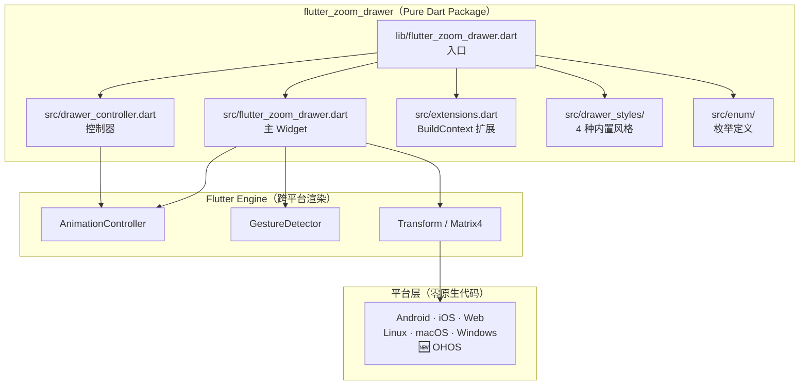

# PRD：Flutter flutter_zoom_drawer 库鸿蒙（OpenHarmony）适配移植方案

> 版本：1.0 | 日期：2026-07-23 | 状态：纯 Dart 包，零改动兼容，待验证
>
> 参照模板：`docs/PRD：Flutter media_scanner 库鸿蒙（OpenHarmony）适配移植方案.md` (v2.0)

---

## 1. 开源软件分析

### 1.1 软件介绍

flutter_zoom_drawer 是 Flutter 生态中的侧边菜单（Drawer）实现库，提供 4 种内置风格的抽屉动画效果：

- **Style 1**：滑动（sliding）
- **Style 2**：滑动 + 阴影（sliding + shadow）
- **Style 3**：滑动 + 旋转（sliding + rotation）
- **Style 4**：滑动 + 旋转 + 阴影（sliding + rotation + shadow）

此外支持**自定义 DrawerStyleBuilder**，允许开发者完全自定义抽屉动画和视觉效果。

**当前支持平台**：Android、iOS、Linux、macOS、Web、Windows（pub.dev 自动判定）

**最新版本**：3.2.0（2024-02-26 发布）

**核心 API**：`ZoomDrawer` Widget + `ZoomDrawerController`

### 1.2 软件架构

flutter_zoom_drawer 采用**纯 Dart 实现**，无任何原生平台代码：



```
┌──────────────────────────────────────────────────────┐
│                  pure Dart Package                    │
│  ┌────────────────────────────────────────────────┐  │
│  │ lib/flutter_zoom_drawer.dart (入口)             │  │
│  │   ├── src/flutter_zoom_drawer.dart  主 Widget   │  │
│  │   ├── src/drawer_controller.dart    控制器       │  │
│  │   ├── src/extensions.dart           BuildContext │  │
│  │   ├── src/drawer_styles/            4 种风格     │  │
│  │   └── src/enum/                     枚举定义     │  │
│  └────────────────────────────────────────────────┘  │
│                                                        │
│  依赖：仅 Flutter SDK（无任何三方包，无原生代码）       │
│  平台检测：kIsWeb + defaultTargetPlatform（标准API）   │
└──────────────────────────────────────────────────────┘
```

**架构特点**：

1. **纯 Dart 实现**：100% Flutter 渲染原语（`AnimationController`、`GestureDetector`、`Transform`/`Matrix4`），零原生平台代码
2. **零三方依赖**：仅依赖 Flutter SDK，无 `vector_math`，无 `path_provider`，无任何附加包
3. **平台无关**：v3.2.0 已移除所有 `dart:io` 引用（为支持 Web），仅使用 `kIsWeb` + `defaultTargetPlatform`
4. **多风格扩展**：通过 `DrawerStyleBuilder` 策略模式支持自定义风格

### 1.3 技术栈及外部依赖

#### 1.3.1 核心技术栈

| 技术层 | 技术选型 | 版本要求 |
|--------|---------|---------|
| 跨端框架 | Flutter | ≥ 3.0.0（Dart SDK ≥ 2.17.0） |
| 开发语言 | Dart | ≥ 2.17.0 |
| 渲染引擎 | Flutter Engine（Skia/Impeller） | Flutter OHOS 分支 |
| 动画系统 | Flutter Animation Framework | Flutter 内置 |
| 手势识别 | Flutter GestureDetector | Flutter 内置 |

#### 1.3.2 外部依赖

| 依赖库 | 类型 | 版本 | 用途 |
|--------|------|------|------|
| `flutter` (SDK) | 运行时 | N/A（Flutter SDK 内置） | UI 框架、动画、手势 |

**零三方运行时依赖。** `flutter_lints: ^3.0.1` 仅为 dev 依赖。

**鸿蒙适配优势**：无原生代码、无系统 API 调用、无 Platform 检查——是所有 Flutter 包中最容易适配的类型。

---

## 2. 鸿蒙化可行性分析

### 2.1 可行性方案

经过技术评估，flutter_zoom_drawer 库具备**零成本、最高可行性**的鸿蒙适配条件：

#### 2.1.1 架构适配可行性 ✓

**现状**：纯 Dart 包，无平台目录（`android/`、`ios/` 等）

**适配方式**：无需创建 `ohos/` 工程、无需编写 ArkTS 代码、无需修改 pubspec.yaml 的 `flutter.plugin.platforms` 声明。

**结论**：纯 Dart 包天然跨平台，**零架构风险**

#### 2.1.2 系统能力可行性 ✓

flutter_zoom_drawer 使用的全部能力均来自 Flutter Framework（不涉及 OS 层）：

| 使用的 Flutter API | 类型 | OHOS 兼容性 |
|-------------------|------|:--:|
| `AnimationController` | 动画驱动 | ✓ Flutter OHOS 引擎支持 |
| `GestureDetector` | 手势识别 | ✓ Flutter OHOS 引擎支持 |
| `Transform` / `Matrix4` | 矩阵变换 | ✓ Flutter OHOS 引擎支持 |
| `Stack` / `Positioned` | 布局 | ✓ Flutter OHOS 引擎支持 |
| `kIsWeb` | 平台检测 | ✓ `foundation.dart` 标准 API |
| `defaultTargetPlatform` | 平台检测 | ✓ `material.dart` 标准 API |

**结论**：所有 API 均为 Flutter Framework 标准组件，**不依赖任何鸿蒙系统 API**

#### 2.1.3 编译适配可行性 ✓

- 无需 `flutter create --platforms ohos`（纯 Dart 包无原生模块）
- 无需 DevEco Studio / hvigor 构建
- 仅需 `flutter pub get` 验证依赖解析

**结论**：无编译适配工作，**零构建工具依赖**

#### 2.1.4 业务兼容可行性 ✓

- API 签名完全不变：`ZoomDrawer(menuScreen, mainScreen, ...)`
- 所有 4 种内置风格行为不变
- 自定义 `DrawerStyleBuilder` 接口不变
- 调用方代码零改动

**结论**：**100% 向后兼容**

### 2.2 风险识别

#### 风险 1：Flutter OHOS 引擎渲染兼容性

**风险描述**：
`Transform` / `Matrix4` 的 3D 旋转效果（Style 3/4）在 Flutter OHOS 渲染引擎上可能存在渲染差异（Skia vs Impeller 或驱动差异），导致动画效果轻微不一致。

**影响范围**：仅 Style 3（旋转）和 Style 4（旋转+阴影），不影响 Style 1/2

**应对策略**：
1. 在鸿蒙真机上验证 Style 3/4 的旋转动画效果
2. 如有差异，通过 OHOS 分支的 `Platform.isOhos` 调整动画参数
3. 纯 Dart 包的修改可控制在 Flutter 层，无需绕过 OHOS 引擎

**优先级**：低（pub.dev 标记 Web 兼容，说明渲染路径跨平台稳定，OHOS 大概率同样兼容）

#### 风险 2：`defaultTargetPlatform` 未识别 OHOS

**风险描述**：
当前代码中的平台判断仅针对 `TargetPlatform.android` 处理返回键逻辑。Flutter OHOS 的 `defaultTargetPlatform` 可能返回 `TargetPlatform.ohos` 或 `TargetPlatform.android`（取决于 SDK 版本），导致返回键行为不一致。

**影响范围**：仅 `androidCloseOnBackTap` 功能（默认为 true），关闭后无功能影响

**应对策略**：
1. 验证 Flutter OHOS SDK 的 `defaultTargetPlatform` 返回值
2. 如需，在条件中增加 `|| defaultTargetPlatform == TargetPlatform.ohos`
3. 该功能与 OHOS 系统返回手势/导航栏兼容

**优先级**：低（功能降级时不影响核心抽屉行为）

#### 风险 3：手势识别精度差异

**风险描述**：
`GestureDetector` 的水平拖拽灵敏度可能在 OHOS 触摸驱动上表现不同。

**影响范围**：所有 Style 的拖拽手势

**应对策略**：
1. 通过 `slidingWidth` 和 `slideWidth` 参数可调整
2. OHOS 端可通过 `dragSensitivity` 参数微调
3. 真机测试验证默认值是否可接受

**优先级**：极低（使用现有 API 参数即可调整，无需代码修改）

---

## 3. 鸿蒙化详细方案

### 3.1 适配策略：纯 Dart 零改动方案

flutter_zoom_drawer 属于 **pure_dart** 类型包（对应 `ohos-coding-guide/pure-dart.md`），适配流程为：

```
1. pubspec.yaml 引入 → 2. flutter pub get → 3. Dart 分析 → 4. 真机验证
```

**无需**：
- ❌ `flutter create --platforms ohos`
- ❌ 创建 `ohos/` 目录
- ❌ 编写 ArkTS / ETS 代码
- ❌ 创建 HAR 模块
- ❌ 修改 `pubspec.yaml` 的 `flutter.plugin.platforms`
- ❌ 添加 `Platform.isOhos` 分支（v3.2.0 已不使用 `Platform`）

### 3.2 引入方式

```yaml
# pubspec.yaml
dependencies:
  flutter_zoom_drawer: ^3.2.0
```

直接使用 pub.dev 原包，无需 fork、无需 git 依赖。

### 3.3 公开 API 规格

### 3.3.1 ZoomDrawer Widget（核心组件）

#### 构造函数

```dart
ZoomDrawer({
  required Widget menuScreen,
  required Widget mainScreen,
  double slideWidth = 275.0,
  double borderRadius = 16.0,
  bool showShadow = false,
  double angle = 0.0,
  Color? backgroundColor,
  Color? overlayColor,
  BlendMode overlayBlendMode = BlendMode.dstATop,
  double disableOverlay = 1.0,
  double dragSensitivity = 5.0,
  double openCurve = Curves.easeOut,
  double closeCurve = Curves.easeInOut,
  Duration duration = const Duration(milliseconds: 500),
  bool reverse = false,
  bool isRTL = false,
  bool androidCloseOnBackTap = true,
  DrawerStyle drawerStyle = DrawerStyle.defaultStyle,
  double mainScreenScale = 1.0,
  double mainScreenAbsorbPointer = 0,
  double menuScreenWidth = 275.0,
  double? mainScreenTapClose = null,
  double menuScreenOffset = 0.0,
  Clip clipMainScreen = false,
  ZoomDrawerController? controller,
  DrawerStyleBuilder? styleBuilder,
  double? shrinkMainScreen,
  bool allowOpen = true,
  DrawerLastAction? lastAction,
  Widget? isOpenDrawer,
  bool desktopGesture = true,
  double? openSize = null,
})
```

| 参数 | 类型 | 必填 | 说明 | 默认值 |
|------|------|:--:|------|--------|
| `menuScreen` | `Widget` | ✅ | 抽屉菜单内容 | — |
| `mainScreen` | `Widget` | ✅ | 主屏幕内容 | — |
| `slideWidth` | `double` | 否 | 抽屉滑出宽度 | `275.0` |
| `borderRadius` | `double` | 否 | 主屏幕圆角半径 | `16.0` |
| `showShadow` | `bool` | 否 | 是否显示阴影 | `false` |
| `angle` | `double` | 否 | 旋转角度（Style 3/4） | `0.0` |
| `duration` | `Duration` | 否 | 动画时长 | `500ms` |
| `drawerStyle` | `DrawerStyle` | 否 | 抽屉样式（defaultStyle/style1-style4） | `DrawerStyle.defaultStyle` |
| `controller` | `ZoomDrawerController?` | 否 | 外部控制器 | `null` |
| `styleBuilder` | `DrawerStyleBuilder?` | 否 | 自定义风格构建器 | `null` |
| `dragSensitivity` | `double` | 否 | 拖拽灵敏度 | `5.0` |
| `androidCloseOnBackTap` | `bool` | 否 | Android 返回键关闭抽屉 | `true` |
| `isRTL` | `bool` | 否 | RTL 布局支持 | `false` |
| `shrinkMainScreen` | `double?` | 否 | Style 2 桌面端主屏缩小值 | `null` |

#### 枚举

```dart
enum DrawerStyle { defaultStyle, style1, style2, style3, style4 }
// defaultStyle = style2 (滑动+阴影)
// style1 = 纯滑动
// style2 = 滑动+阴影
// style3 = 滑动+旋转
// style4 = 滑动+旋转+阴影

enum DrawerState { open, closed, opening, closing }
enum DrawerLastAction { open, close, toggle, switchScreen }
```

### 3.3.2 ZoomDrawerController（控制器）

| 方法/属性 | 签名 | 说明 |
|-----------|------|------|
| `toggle()` | `void toggle()` | 切换抽屉开/关 |
| `open()` | `void open()` | 打开抽屉 |
| `close()` | `void close()` | 关闭抽屉 |
| `state` | `DrawerState` | 当前状态 |
| `isOpen()` | `bool isOpen()` | 是否打开中 |
| `switchScreen()` | `void switchScreen()` | 切换主屏（配合动画） |
| `dispose()` | `void dispose()` | 释放资源 |

### 3.3.3 BuildContext 扩展

```dart
// 通过 context 获取控制器（无需显式传递 controller）
ZoomDrawerController zoomDrawer = ZoomDrawer.of(context);
zoomDrawer.toggle();
zoomDrawer.open();
zoomDrawer.close();
```

### 3.4 数据流与调用链

```mermaid
sequenceDiagram
    actor User as 用户
    participant GD as GestureDetector
    participant ZDC as ZoomDrawerController
    participant AC as AnimationController
    participant Tween as Tween&lt;Matrix4&gt;
    participant TF as Transform Widget
    participant UI as 主屏幕 / 菜单屏幕

    User->>GD: 水平拖拽 / 点击按钮
    GD->>ZDC: onHorizontalDragUpdate() / onTap()
    alt 打开抽屉
        ZDC->>AC: forward()
    else 关闭抽屉
        ZDC->>AC: reverse()
    end
    AC->>Tween: 驱动动画值 (0.0 → 1.0)
    loop 每帧 tick
        Tween->>TF: 更新 Matrix4 变换矩阵
        TF->>UI: 重绘（位移/缩放/旋转）
    end
    UI-->>User: 抽屉动画完成
```

```
用户手势/点击
  ↓
GestureDetector (onHorizontalDragUpdate / onTap)
  ↓
ZoomDrawerController.toggle() / open() / close()
  ↓
AnimationController.forward() / reverse()
  ↓
Tween<Matrix4> → Transform widget → 每帧重新渲染
  ↓
主屏幕 位移/缩放/旋转  → 菜单屏幕 滑入
```

**关键点**：全链路均在 Dart/Flutter Framework 层完成，不经过 MethodChannel，不涉及任何平台通信。

### 3.5 权限需求

**无。** 纯 UI 组件，不访问任何系统权限。

---

## 4. 完整性自检清单

### 4.1 API 覆盖统计

| 类别 | 总数 | PRD 中已列出 |
|------|------|:--:|
| Widget | 1 (`ZoomDrawer`) | ✅ |
| Controller | 1 (`ZoomDrawerController`) | ✅ |
| 枚举 | 3 (`DrawerStyle`, `DrawerState`, `DrawerLastAction`) | ✅ |
| 扩展方法 | 1 (`ZoomDrawer.of(context)`) | ✅ |
| 构造参数 | 28 | ✅ |
| 控制器方法/属性 | 6 | ✅ |

### 4.2 交叉验证

- [x] `lib/flutter_zoom_drawer.dart` 导出的所有 API 均已在第 3 章列出
- [x] `ZoomDrawer` 所有构造参数均已在第 3.3.1 节列出
- [x] `ZoomDrawerController` 所有公开方法均已在第 3.3.2 节列出
- [x] 4 种内置风格 + 自定义风格均已在枚举和 API 中覆盖
- [x] README 中提及的功能均已在本文档中体现
- [x] 无原生平台代码（无 android/ios 目录），无需平台实现比对

---

## 5. 适配结论

| 维度 | 评估 |
|------|------|
| 适配类型 | **pure_dart**（纯 Dart 包，零原生代码） |
| 适配状态 | 未入 adapted-libraries.json（建议标记为 `pure_dart`） |
| 需修改代码 | **0 行** |
| 需创建工程 | **无** |
| 需编译验证 | `flutter pub get` |
| 运行时风险 | 极低（仅 Flutter 引擎渲染差异可能性） |
| 建议操作 | 直接引入 pub.dev 原包，在鸿蒙设备/模拟器上做手势+动画验证 |

---

## 6. 修订记录

| 版本 | 日期 | 变更说明 | 作者 |
|------|------|---------|------|
| 1.0 | 2026-07-23 | 初始版本：基于 GitHub 源码分析（v3.2.0）+ full pure_dart package compatibility assessment | — |

---

## 参考资料

- pub.dev: https://pub.dev/packages/flutter_zoom_drawer
- GitHub: https://github.com/medyas/flutter_zoom_drawer
- Pure Dart 适配指南: `docs/flutter_library_workflow/skills/flutter/ohos-coding-guide/pure-dart.md`
- 已适配库数据库: `docs/flutter_library_workflow/skills/flutter/flutter-adapted-library/references/adapted-libraries.json`
- 类似包参考: `animations` v2.0.11（已适配 OHOS 的纯 Dart UI 组件）
