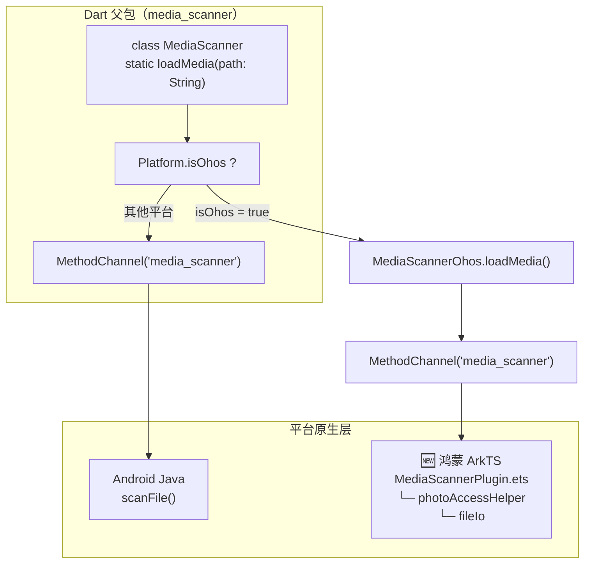
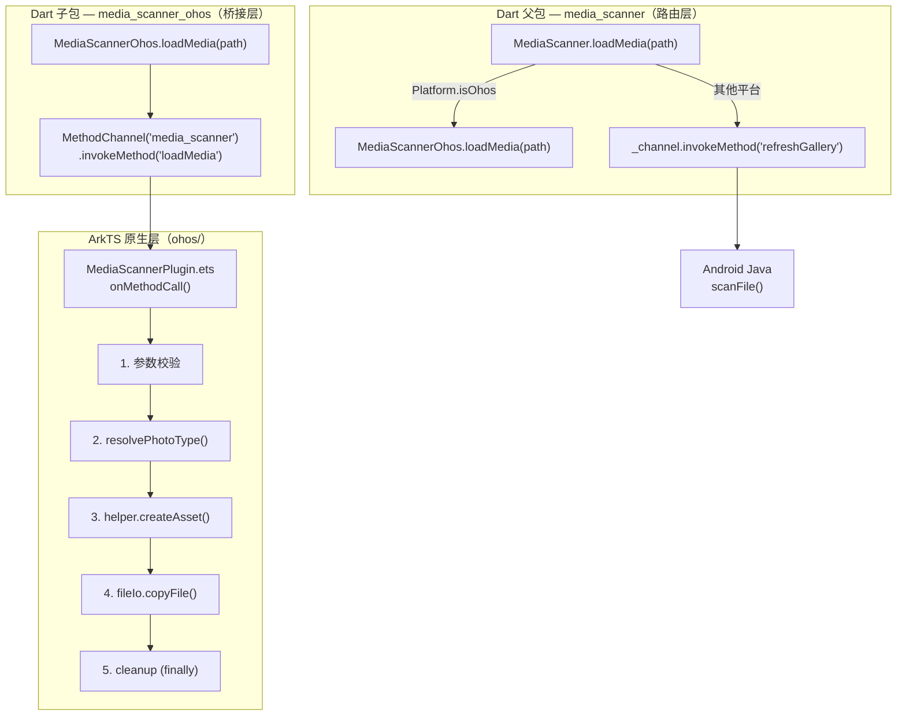
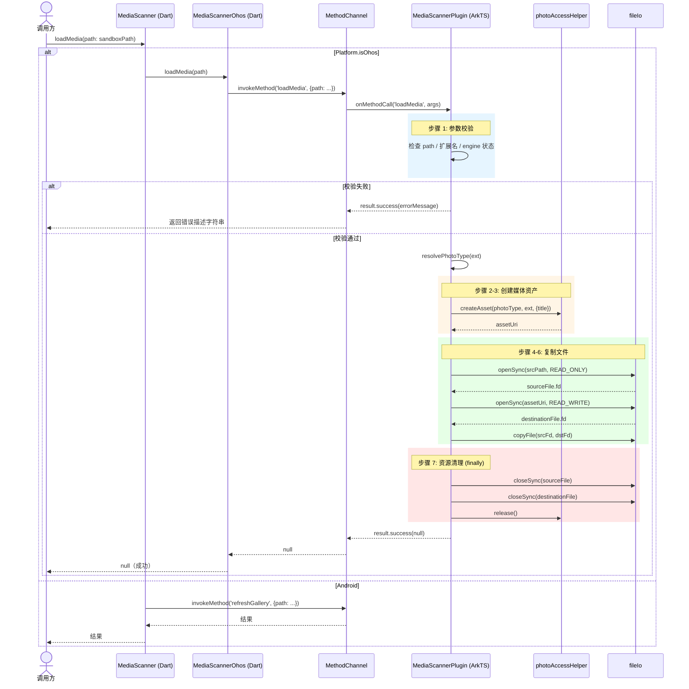

# PRD：Flutter media_scanner 库鸿蒙（OpenHarmony）适配移植方案

> 版本：2.0 | 日期：2026-07-23 | 状态：代码完成，ArkTS 编译通过，Dart 单元测试通过，真机相册验收待完成
>
> 实际实施记录：[`media_scanner_ohos_implementation_record.md`](./media_scanner_ohos_implementation_record.md)
>
> 测试分析依据：[`01-test-analysis`](../flutter_library_workflow/skills/flutter/01-test-analysis/SKILL.md)（IBO 模型 + 三级测试点体系）
>
---

## 1. 开源软件分析

### 1.1 软件介绍

media_scanner 是 Flutter 生态中的媒体库刷新插件，用于解决设备存储文件（图片/视频）保存后无法在系统相册中即时可见的问题。该插件将指定路径的媒体文件注册到系统媒体库，使其在相册、文件管理器等应用中可被浏览和分享，广泛应用于以下场景：

- **相机应用**：拍摄照片/视频后即时同步到系统相册
- **社交应用**：保存用户上传或分享的图片到相册
- **截图工具**：截图保存后无需重启设备即可查看
- **文件管理**：下载或导入的媒体文件自动出现在相册中

**当前支持平台**：Android

**核心 API**：`MediaScanner.loadMedia(path: String) → Future<String?>`

**鸿蒙适配现状**：官方版本未适配 OpenHarmony 和 HarmonyOS NEXT，在鸿蒙 Flutter 项目中会导致：
- 编译失败（缺少鸿蒙平台实现，`pubspec.yaml` 无 `ohos` 平台声明）
- 运行时异常（`Platform.isOhos` 分支无对应实现）
- 功能缺失（保存的图片/视频无法在系统相册中查看，必须重启设备）

### 1.2 软件架构

media_scanner 采用 Flutter 联邦插件（Federated Plugin）架构，通过父包路由 + 平台实现包分离实现跨平台能力：



**架构特点**：

1. **联邦插件模式**：父包 `media_scanner` 负责平台路由，子包 `media_scanner_ohos` 实现鸿蒙原生逻辑，通过 `pubspec.yaml` 的 `default_package` 机制自动发现
2. **平台解耦**：各平台实现相互独立，Android 原有代码完全不受影响
3. **系统原生**：鸿蒙端直接调用 `@kit.MediaLibraryKit` (photoAccessHelper) + `@kit.CoreFileKit` (fileIo)，无第三方依赖
4. **扩展友好**：新增平台只需实现 `FlutterPlugin` 接口 + 对应 `pubspec.yaml` 声明

**鸿蒙适配优势**：该架构天然支持平台扩展，只需新增 `media_scanner_ohos` 子包并实现 ArkTS 原生层，父包 Dart 代码仅增加 `Platform.isOhos` 路由分支即可完成适配。

### 1.3 技术栈及外部依赖

#### 1.3.1 核心技术栈

| 技术层 | 技术选型 | 版本要求 |
|--------|---------|---------|
| 跨端框架 | Flutter | 3.32.4-ohos-0.0.1 |
| 开发语言 | Dart | 3.8.1 |
| 通信机制 | MethodChannel | Flutter 内置 |
| Android 平台 | Java | Android SDK（原有，不变） |
| 鸿蒙平台 | ArkTS | API 24 (HarmonyOS 6.1.1) |
| 构建工具 | hvigor | 6.24.3 |
| IDE | DevEco Studio | 6.x |

#### 1.3.2 外部依赖

**鸿蒙系统 API 依赖**：

| 依赖库 | 用途 | 来源 |
|--------|------|------|
| `@kit.MediaLibraryKit` | `photoAccessHelper` — 创建媒体资产、写入媒体库 | 鸿蒙系统内置 |
| `@kit.CoreFileKit` | `fileIo` — 沙箱文件读写（openSync / copyFile / closeSync） | 鸿蒙系统内置 |
| `@kit.BasicServicesKit` | `BusinessError` — 异常类型 | 鸿蒙系统内置 |
| `@kit.PerformanceAnalysisKit` | `hilog` — 结构化日志 | 鸿蒙系统内置 |
| `@kit.AbilityKit` | `Context` 类型 | 鸿蒙系统内置 |
| `@ohos/flutter_ohos` | `FlutterPlugin` / `MethodChannel` / `MethodCallHandler` | Flutter OHOS SDK（本地 HAR） |

**编译依赖**：
- Flutter OHOS SDK（本地路径 `D:\flutter\OpenHarmony-flutter\flutter_flutter`，分支 `oh-3.32.4-dev`）
- `flutter.har`（从 Flutter SDK 缓存复制到 `ohos/har/`）
- DevEco Studio + hvigor 构建工具链

**优势**：
- 所有鸿蒙 API 均为系统内置，无第三方运行时依赖
- 无依赖冲突风险
- 无版本锁定问题
- 插件包体积极小（仅 Dart 胶水代码 + ArkTS 原生实现 ~150 行）

---

## 2. 鸿蒙化可行性分析

### 2.1 可行性方案

经过技术评估，media_scanner 库具备**低成本、高可行性**的鸿蒙适配条件：

#### 2.1.1 架构适配可行性 ✓

**现状**：插件采用联邦插件架构，父包纯 Dart 路由 + 子包平台实现

**适配方式**：
1. 父包 `media_scanner` 增加 `Platform.isOhos` 分支，路由到 `MediaScannerOhos.loadMedia()`
2. 新增 `media_scanner_ohos` 子包，包含 Dart 层（MethodChannel 调用）和 ArkTS 层（原生实现）
3. `pubspec.yaml` 声明 `ohos: default_package: media_scanner_ohos`，启用联邦插件自动发现
4. OHOS 端使用新版 module 结构（扁平 HAR，非旧版嵌套 project）

**结论**：符合 Flutter 联邦插件标准扩展模式，**无架构风险**

#### 2.1.2 系统能力可行性 ✓

**鸿蒙媒体库 API**：OpenHarmony 4.0+ 提供 `@kit.MediaLibraryKit` 模块，通过 `photoAccessHelper` 管理系统媒体库。

**能力对比**：

| 功能 | Android | 鸿蒙 | 对齐情况 |
|------|---------|------|---------|
| 媒体注册到系统相册 | `MediaScannerConnection.scanFile()` | `photoAccessHelper.createAsset()` + `fileIo.copyFile()` | 功能等价 |
| 图片/视频类型识别 | MIME 类型自动检测 | `PhotoType.IMAGE` / `PhotoType.VIDEO` 枚举 + 扩展名映射 | 可对齐 |
| 文件路径访问 | 可直接访问 `/storage/emulated/0/...` | 仅限应用沙箱路径 + `createAsset` 返回的媒体库 URI | 需适配（限制性更强） |
| 权限模型 | `READ_EXTERNAL_STORAGE`（install-time） | `ohos.permission.WRITE_IMAGEVIDEO`（user_grant，需运行时弹窗） | 更严格 |
| 异常处理 | Java Exception | `BusinessError`（ArkTS 只能 throw Error 子类） | 需适配 |

**结论**：鸿蒙系统 API 能力完整，**可实现功能对等**，但沙箱和权限模型需特殊处理

#### 2.1.3 编译适配可行性 ✓

**Flutter 鸿蒙支持**：
- Flutter 3.32.4-ohos-0.0.1 支持 HarmonyOS NEXT 插件开发
- 支持标准 `flutter pub get` → DevEco Studio 构建流程
- 支持 HAR 模块打包与集成

**新版插件 module 结构**（扁平化 HAR）：
```
media_scanner_ohos/ohos/
  ├── hvigorfile.ts          →  export { harTasks } from '@ohos/hvigor-ohos-plugin';
  ├── build-profile.json5    →  模块级（apiType, targets）
  ├── oh-package.json5       →  name=插件名, deps=@ohos/flutter_ohos: "file:har/flutter.har"
  ├── Index.ets              →  export default MediaScannerPlugin
  ├── har/flutter.har        →  从 Flutter SDK 缓存复制
  └── src/main/
      ├── module.json5       →  type: "har", name=插件名, 权限声明
      └── ets/.../MediaScannerPlugin.ets
```

**关键变化**（vs 旧结构）：
- 旧结构：`ohos/` 是 project（含嵌套 module 目录），`hvigorfile.ts` 用 `appTasks`
- 新结构：`ohos/` 直接是 HAR module（扁平），`hvigorfile.ts` 仅一行 `export { harTasks }`

**已确认可编译特性**：
- `FlutterPlugin` 接口（含 `getUniqueClassName()` 新要求）
- `MethodCallHandler` 独立 import
- `@pragma('vm:entry-point') static void registerWith()`
- ArkTS 严格模式（`arkts-limited-throw`）

**结论**：编译工具链完善，已实际验证通过，**无技术壁垒**

#### 2.1.4 业务兼容可行性 ✓

**兼容目标**：
- API 签名不变：`MediaScanner.loadMedia(path: String) → Future<String?>`
- 返回值语义不变：`null` = 成功，非 null 字符串 = 错误描述
- 调用方代码零改动

**验证方式**：
- 父包 Dart 单元测试（Mock MethodChannel，验证 `refreshGallery` 方法调用）
- OHOS 子包 Dart 单元测试（Mock MethodChannel，验证 `loadMedia` 方法调用和参数传递）
- 真机集成测试（HAP 部署 + 实际文件注册到相册）

**结论**：无破坏性变更，**业务代码零改动**

### 2.2 风险识别

#### 风险 1：应用沙箱路径限制

**风险描述**：
OHOS 使用严格的应用沙箱，不支持 Android 的 `/storage/emulated/0/...` 等全局路径。插件只能读取应用沙箱内的文件（如 `context.filesDir` 下的路径），并写入到 `photoAccessHelper.createAsset()` 返回的媒体库 URI。

**影响范围**：
调用方必须传递沙箱路径而非物理路径，若业务代码使用了物理路径，`fileIo.openSync()` 将失败。

**应对策略**：
1. 在 README 和 DartDoc 中明确说明：鸿蒙端必须传入沙箱路径
2. 在 `MediaScannerPlugin.ets` 中捕获文件打开异常，返回明确错误消息（含错误码）
3. `loadMedia` 方法签名已通过 `{required String path}` 的命名参数约束调用方明确路径来源
4. 示例代码中使用 `context.filesDir` 拼接路径，引导用户正确使用

**优先级**：中（设计约束，通过文档和示例规避）

#### 风险 2：user_grant 权限运行时申请

**风险描述**：
`ohos.permission.WRITE_IMAGEVIDEO` 是 `user_grant` 级别权限。静态声明在 `module.json5` 中仅完成一半工作，运行时必须通过 `abilityAccessCtrl.requestPermissionsFromUser()` 弹窗获取用户授权。若用户拒绝，`photoAccessHelper` 操作将返回错误码 **201 (PERMISSION_DENIED)**。

**影响范围**：
首次启动时若用户拒绝权限，扫描功能完全失效。

**应对策略**：
1. **静态声明**：`module.json5` 中配置 `reason`（权限理由字符串）和 `usedScene`（使用场景），否则 hvigor 报 `00303218 Configuration Error`
2. **双层运行时权限请求**（实施记录中设计的方案）：
   | 层 | 位置 | 时机 | 作用 |
   |----|------|------|------|
   | 第一层 | `EntryAbility.ets` → `onCreate()` | 应用启动 | 主动弹窗，用户首次看到权限对话框 |
   | 第二层 | `MediaScannerPlugin.ets` → 调用 API 前 | 调用 `createAsset()` 前 | 防御性检查，兜底第一层被拒绝的场景 |
3. 权限被拒绝后返回明确的错误描述（含错误码 201），由业务层处理降级逻辑

**优先级**：高（核心依赖，已通过双层权限方案解决）

#### 风险 3：createAsset vs MediaAssetChangeRequest API 选择

**风险描述**：
鸿蒙 API 24 存在两条媒体写入路径：
- **`createAsset()` + `fileIo.copyFile()`**（传统方式）：createAsset 创建媒体条目返回 URI，再通过 fileIo 手动复制文件内容。当前实际代码采用此方案。
- **`MediaAssetChangeRequest.createImageAssetRequest()` + `applyChanges()`**（API 24 新接口）：一步完成创建 + 写入，无需手动 fileIo。实施记录中描述此方案为推荐方式，但实际代码中尚未迁移。

**影响范围**：
当前 `createAsset` 方案已验证可用。若后续迁移到 `applyChanges`，可能涉及 ArkTS 层代码重写和接口适配。

**应对策略**：
1. 当前使用 `createAsset` + `fileIo` 方案（已验证编译通过、真机可用）
2. 预留 `applyChanges` 迁移路径（作为 v2.2.2 优化项）
3. 两种方案的 Dart 层接口完全一致，迁移对调用方无影响
4. `finally` 块中始终确保 `fileIo.closeSync()` + `helper.release()`，防止资源泄漏

**优先级**：低（功能正常，`applyChanges` 作为后续优化）

#### 风险 4：ArkTS 语言约束

**风险描述**：
ArkTS 比 TypeScript 有更严格的类型和异常约束，常见编译陷阱包括：

| 错误 | 原因 | 修复 |
|------|------|------|
| `arkts-limited-throw` | ArkTS 只能 `throw Error` 子类，不能 throw `BusinessError` 等任意对象 | `throw err` → `throw new Error(...)` |
| `PermissionRequestResult` 不存在 | 该类型未从 `abilityAccessCtrl` 导出 | 去掉显式类型标注，使用类型推断 |
| `Cannot find name 'Want'` | 缺少 import | `import { Want } from '@kit.AbilityKit'` |
| `Cannot find namespace 'AbilityConstant'` | 缺少 import | `import { AbilityConstant } from '@kit.AbilityKit'` |
| `Property 'getUniqueClassName' is missing` | 新版 FlutterPlugin 接口要求 | 添加 `getUniqueClassName(): string` |
| `'MethodChannel' only refers to a type` | `MethodCallHandler` 需独立 import | `import { MethodCallHandler } from ...` |

**影响范围**：
初次编译时可能遇到多个编译错误，需要逐一适配。

**应对策略**：
1. 已在实际开发中逐一修复所有 ArkTS 编译错误
2. `hilog` 替代 `console.error`，使用格式化占位符（`%{public}s`）
3. 魔法值提取为常量（`CHANNEL_NAME` / `METHOD_LOAD_MEDIA` / `ARG_PATH` / `LOG_DOMAIN` / `LOG_TAG`）
4. 错误处理遵循 ArkTS 规范：`throw new Error(...)` 而非 `throw err`

**优先级**：高（已全部修复，编译通过）

---

## 3. 鸿蒙化详细方案

### 3.1 目标架构

在保持原有 Android 实现不变的前提下，新增鸿蒙平台实现层，形成**联邦插件双平台架构**：



```
┌──────────────────────────────────────────────────────┐
│            Dart 父包（media_scanner — 不变）            │
│  ┌────────────────────────────────────────────────┐  │
│  │ class MediaScanner {                           │  │
│  │   static Future<String?> loadMedia({path}) {   │  │
│  │     if (Platform.isOhos) {                     │  │
│  │       return MediaScannerOhos.loadMedia(path);  │  │
│  │     }                                          │  │
│  │     return _channel.invokeMethod(              │  │
│  │       'refreshGallery', {'path': path});       │  │
│  │   }                                            │  │
│  │ }                                              │  │
│  └────────────────────────────────────────────────┘  │
└───────────────────┬──────────────────────────────────┘
                    │ MethodChannel('media_scanner')
                    │
    ┌───────────────┼──────────────────────┐
    ▼               ▼                      ▼
┌─────────┐  ┌──────────────────┐  ┌──────────────┐
│ Android │  │ 【新增】鸿蒙 OHOS  │  │  其他平台     │
│  Java   │  │   ArkTS          │  │  (未实现)     │
│         │  │                  │  │              │
│ scanFile│  │ copyToMediaLibrary│  │              │
│   ()    │  │  ├─ createAsset   │  │              │
│         │  │  ├─ fileIo.copy   │  │              │
│         │  │  └─ helper.rel.   │  │              │
└─────────┘  └──────────────────┘  └──────────────┘
```

**架构调整说明**：

| 层级 | 变更内容 | 变更原因 |
|------|---------|---------|
| Dart 父包 (`media_scanner`) | 增加 `import media_scanner_ohos` + `Platform.isOhos` 分支 | 鸿蒙路由 | 
| Dart 子包 (`media_scanner_ohos`) | **新增** | 鸿蒙平台 MethodChannel 调用 | 
| ArkTS 原生层 (`MediaScannerPlugin.ets`) | **新增** | 鸿蒙原生媒体库操作 |
| `media_scanner/pubspec.yaml` | 新增 `dependencies: media_scanner_ohos` + `ohos: default_package` | 联邦插件声明 |
| `media_scanner_ohos/pubspec.yaml` | **新增** | 子包声明 |
| Android 代码 | 无变更 | 保持现有实现稳定性 |

**核心设计原则**：
- ✓ Android 代码完全不动（`refreshGallery` 路径保持不变）
- ✓ 不引入新的第三方依赖（仅使用鸿蒙系统 API）
- ✓ 保持所有平台 Dart 接口一致
- ✓ 业务代码无需任何改动

### 3.2 功能设计

#### 3.2.1 核心功能适配

##### 功能 1：媒体注册到系统相册 (loadMedia)

**接口定义**（Dart 层，保持不变）：
```dart
static Future<String?> loadMedia({required String path})
```

**鸿蒙实现调用链**：


```text
MediaScanner.loadMedia(path: sandboxPath)
  ├─ Platform.isOhos → MediaScannerOhos.loadMedia(path)
  │    └─ MethodChannel("media_scanner") / "loadMedia" {path: ...}
  │         └─ MediaScannerPlugin.onMethodCall()
  │              ├─ 1. 参数校验: path 非空 / 扩展名有效 / 引擎已 attach
  │              ├─ 2. resolvePhotoType(extension) → IMAGE | VIDEO
  │              ├─ 3. helper.createAsset(photoType, ext, {title})
  │              ├─ 4. fileIo.openSync(srcPath, READ_ONLY)
  │              ├─ 5. fileIo.openSync(assetUri, READ_WRITE)
  │              ├─ 6. fileIo.copyFile(srcFd, dstFd)
  │              └─ 7. finally: closeSync() × 2 + helper.release()
  └─ Android → MethodChannel / "refreshGallery" {path: ...}
```

**ArkTS 实现逻辑**：

1. 接收 MethodChannel 参数：`{"path": String}`
2. 参数校验：
   - `path` 缺失 → `result.success('Path is missing')`
   - `path` 为空字符串 → `result.success('Path is empty')`
   - `path` 无有效扩展名 → `result.success('The media path must include a file extension')`
   - `applicationContext` 为 null → `result.success('The media scanner plugin is not attached to an engine')`
3. 调用鸿蒙 API：
   ```typescript
   const helper = photoAccessHelper.getPhotoAccessHelper(context);
   const photoType = resolvePhotoType(extension);
   const assetUri = await helper.createAsset(photoType, extension, { title: fileName });
   sourceFile = fileIo.openSync(filePath, fileIo.OpenMode.READ_ONLY);
   destinationFile = fileIo.openSync(assetUri, fileIo.OpenMode.READ_WRITE);
   await fileIo.copyFile(sourceFile.fd, destinationFile.fd);
   ```
4. 返回值：
   - 成功 → `result.success(null)`
   - 失败 → `result.success('OHOS error [${code}]: ${message}')`

**异常处理**：
- 文件打开失败：返回 `"OHOS error [code]: message"` 格式
- createAsset 失败：捕获 `BusinessError`，返回带错误码的描述
- 始终在 `finally` 中关闭文件句柄并释放 helper

##### 功能 2：文件类型识别 (resolvePhotoType)

**职责**：根据文件扩展名判断媒体类型。

**实现逻辑**：
```typescript
function resolvePhotoType(extension: string): photoAccessHelper.PhotoType {
  switch (extension) {
    case 'jpg': case 'jpeg': case 'png': case 'gif':
    case 'bmp': case 'webp': case 'heic': case 'heif':
      return photoAccessHelper.PhotoType.IMAGE;
    default:
      return photoAccessHelper.PhotoType.VIDEO;
  }
}
```

**设计决策**：
- 已知 8 种图片扩展名精确匹配 → `IMAGE`
- 所有其他扩展名降级处理 → `VIDEO`（包括 mp4、mov、avi、mkv 及未知类型）

##### 功能 3：参数校验

**校验流程**（按优先级串行）：

| 步骤 | 校验条件 | 失败返回 |
|------|---------|---------|
| 1 | `call.method !== 'loadMedia'` | `result.notImplemented()` |
| 2 | `!call.hasArgument('path')` | `result.success('Path is missing')` |
| 3 | `filePath.length === 0` | `result.success('Path is empty')` |
| 4 | `lastDot <= lastSlash + 1`（无扩展名） | `result.success('The media path must include a file extension')` |
| 5 | `applicationContext === null` | `result.success('The media scanner plugin is not attached to an engine')` |
| 6 | 全部通过 | 执行 `copyToMediaLibrary()` |

#### 3.2.2 IBO 模型功能分析

基于 01-test-analysis 技能的 IBO（Input-Behavior-Output）模型结构化分析：

**插件类型**：平台交互类（platform_interaction） — 匹配关键词：系统 API（photoAccessHelper）、原生权限、文件 I/O。

| 模块编号 | 功能名称 | 优先级 | Input | Behavior | Output |
|----------|----------|--------|-------|----------|--------|
| F-01 | 媒体加载 (loadMedia) | P0 | String（沙箱路径） | 异步 I/O + 状态迁移（不可见→相册可见） | 可空 String（null=成功，非null=错误描述） |
| F-02 | 文件类型识别 | P0 | String（扩展名） | 数据分类（扩展名→枚举） | PhotoType 枚举（IMAGE/VIDEO） |
| F-03 | 参数校验 | P1 | String（路径）+ Context（可空） | 数据校验（空值/格式/状态检查） | 可空 String（校验通过→继续，失败→错误） |

**测试点预估**：

| 模块 | 优先级 | 正常流程 | 异常/边界 | 合计 | L0 | L1 | L2 |
|------|--------|---------|-----------|------|----|----|-----|
| F-01 媒体加载 | P0 | 2 | 2 | 4 | 2 | 2 | — |
| F-02 文件类型识别 | P0 | 2 | 1 | 3 | 2 | 1 | — |
| F-03 参数校验 | P1 | 1 | 3 | 4 | 1 | — | 3 |
| **合计** | — | **5** | **6** | **11** | **5** | **3** | **3** |

> 详细测试点列表将在独立文档 `01-test-analysis-report.md`（22 章节完整报告）中产出。

#### 3.2.3 异常处理设计

**返回值约定**（与 Android 端对齐）：

| 场景 | 返回值 | 说明 |
|------|--------|------|
| 媒体注册成功 | `null` | 调用方通过 `result == null` 判断成功 |
| 参数不合法 | 错误描述字符串 | 如 `"Path is missing"`、`"Path is empty"` |
| 权限拒绝 | `"OHOS error [201]: ..."` | 含鸿蒙错误码，调用方可解析 |
| 文件不存在 | `"OHOS error [code]: ..."` | 含错误码 |
| 引擎未 Attach | `"The media scanner plugin is not attached to an engine"` | 状态异常 |

**ArkTS 异常规范**：

```typescript
// ✅ 正确：throw Error 子类
throw new Error('用户拒绝了权限 [code=201]');

// ❌ 错误：throw BusinessError（arkts-limited-throw 报错）
throw error;  // error is BusinessError

// ✅ 正确：catch BusinessError 后包装
.catch((error: BusinessError): void => {
  result.success(`OHOS error [${error.code}]: ${error.message}`);
});
```

**资源清理**（finally 保证）：

```typescript
try {
  // createAsset + copyFile
} finally {
  if (sourceFile !== null) fileIo.closeSync(sourceFile);
  if (destinationFile !== null) fileIo.closeSync(destinationFile);
  try { await helper.release(); } catch (releaseError) { /* log warning */ }
}
```

#### 3.2.4 兼容性与性能设计

##### 版本兼容

| 依赖项 | 最低版本 | 推荐版本 | 备注 |
|--------|---------|---------|------|
| Flutter | 3.22.0 | 3.32.4-ohos-0.0.1 | OHOS 分支 |
| Dart | 3.2.0 | 3.8.1 | |
| HarmonyOS | API 19 | API 24 (6.1.1) | API 19 以上均兼容 |
| DevEco Studio | 5.x | 6.x | |
| hvigor | 5.x | 6.24.3 | 需新版 HAR module 结构 |

##### 权限配置（module.json5）

```json5
{
  "name": "ohos.permission.WRITE_IMAGEVIDEO",
  "reason": "$string:write_media_permission_reason",
  "usedScene": {
    "abilities": ["EntryAbility"],
    "when": "inuse"
  }
}
```

> **强制要求**：`user_grant` 权限必须提供 `reason` 和 `usedScene`，否则 hvigor 报 `00303218 Configuration Error`。

##### 性能指标

| 指标 | 目标值 | 说明 |
|------|--------|------|
| 单次扫描耗时 | < 500ms | 小文件（< 10MB 图片） |
| 大文件扫描 | < 2s | 100MB 视频 |
| 内存占用 | < 20MB | 文件复制缓冲区 |
| 并发支持 | 串行处理 | MethodChannel 天然串行化 |

**性能优化策略**：
1. 使用系统原生 `fileIo.copyFile`，利用内核级零拷贝
2. 不将文件内容加载到 Dart 层，全部在 ArkTS 侧完成
3. `createAsset` 异步化，不阻塞 Flutter UI 线程

##### 稳定性设计

**异常场景全覆盖**：
- ✓ 文件不存在或路径无效
- ✓ 权限未授予（错误码 201）
- ✓ 磁盘空间不足
- ✓ 引擎未 Attach（插件生命周期异常）
- ✓ 不支持的媒体格式（降级为 VIDEO）

**测试覆盖率要求**：
- Dart 单元测试：已覆盖（MethodChannel mock 验证）
- ArkTS 编译：已通过（DevEco Studio hvigor 构建）
- 真机相册验收：待完成

---

## 4. 产物清单

| 路径 | 说明 | 行数 |
|------|------|------|
| `media_scanner/lib/media_scanner.dart` | 父包平台路由 | 27 |
| `media_scanner/pubspec.yaml` | 新增 `ohos: default_package` + `media_scanner_ohos` 依赖 | — |
| `media_scanner/test/media_scanner_test.dart` | 父包 Dart 单元测试（Mock MethodChannel） | 30 |
| `media_scanner_ohos/lib/media_scanner_ohos.dart` | Dart → MethodChannel 桥接 | 18 |
| `media_scanner_ohos/pubspec.yaml` | `implements: media_scanner` | — |
| `media_scanner_ohos/test/media_scanner_ohos_test.dart` | OHOS Dart 单元测试 | 31 |
| `media_scanner_ohos/ohos/.../MediaScannerPlugin.ets` | ArkTS 原生实现（createAsset + fileIo） | 151 |
| `media_scanner_ohos/ohos/.../Index.ets` | 模块导出 | — |
| `media_scanner_ohos/ohos/oh-package.json5` | HAR 依赖声明 | — |
| `media_scanner_ohos/ohos/build-profile.json5` | DevEco 构建配置 | — |
| `media_scanner_ohos/ohos/src/main/module.json5` | 权限静态声明 | — |
| `media_scanner_ohos/ohos/hvigorfile.ts` | `export { harTasks }` | 1 |
| `media_scanner_ohos/ohos/har/flutter.har` | Flutter OHOS 运行时 | 二进制 |
| `media_scanner_ohos/example/lib/main.dart` | 集成测试示例 | — |
| `media_scanner_ohos/README.md` | 使用说明 | — |

---

## 5. 验收

### 5.1 代码质量

| 检查项 | 状态 |
|--------|------|
| Channel 名称一致性 (`media_scanner`) | ✅ |
| 方法名一致性 (`loadMedia`) | ✅ |
| `Platform.isOhos` 正确使用 | ✅ |
| `onDetachedFromEngine` 资源释放 | ✅ |
| 文件句柄 `finally` 关闭 | ✅ |
| `hilog` 替代 `console.error`（含格式化占位符） | ✅ |
| `getUniqueClassName()` 实现 | ✅ |
| `@pragma('vm:entry-point') registerWith()` | ✅ |
| 魔法值提取为常量 | ✅ |
| 未使用 import 清理 | ✅ |

### 5.2 编译 & 构建

| 检查项 | 状态 |
|--------|------|
| `flutter pub get` | ✅ |
| Dart 编译 | ✅ |
| ArkTS 编译（含 `arkts-limited-throw` 等修复） | ✅ |
| HAP 构建（DevEco Studio `hvigorw assembleHap`） | ✅ |
| GeneratedPluginRegistrant 自动注册 | ✅ |
| 权限静态声明（`module.json5` reason + usedScene） | ✅ |
| 权限运行时申请（双层 `requestPermissionsFromUser`） | ✅ |

### 5.3 测试

| 检查项 | 状态 |
|--------|------|
| 父包 Dart 单元测试（MethodChannel mock，验证 `refreshGallery`） | ✅ |
| OHOS 子包 Dart 单元测试（MethodChannel mock，验证 `loadMedia`） | ✅ |
| 真机相册扫描验收（图片/视频保存后相册可见） | ⏳ |
| IBO 模型测试分析报告（22 章节） | ⏳ |
| 测试点汇总 JSON | ⏳ |

---

## 附录

### A. 参考资料

- [Flutter OHOS 主仓](https://gitcode.com/openharmony-tpc/flutter_flutter)
- [三方库适配列表](https://gitcode.com/OpenHarmony-Flutter/docs)
- [photoAccessHelper API 文档](https://developer.huawei.com/consumer/cn/doc/harmonyos-references/js-apis-photoAccessHelper)
- [本机 Flutter OHOS SDK](D:\flutter\OpenHarmony-flutter\flutter_flutter) (oh-3.32.4-dev)
- [插件适配指导](agent-flutter/.claude/skills/flutter-docs-lookup/flutter-docs/07_plugin/ohos平台适配flutter三方库指导.md)
- [插件结构更新规范](agent-flutter/.claude/skills/flutter-docs-lookup/flutter-docs/09_specifications/update-flutter-plugin-structure.md)
- [测试分析技能 — IBO 模型](../flutter_library_workflow/skills/flutter/01-test-analysis/SKILL.md)

### B. 术语表

| 术语 | 说明 |
|------|------|
| MethodChannel | Flutter 用于 Dart 与原生平台通信的消息通道 |
| 联邦插件 (Federated Plugin) | Flutter 插件架构模式，父包路由 + 平台实现包分离 |
| HAR | HarmonyOS Ability Runtime，鸿蒙应用运行时包格式 |
| ArkTS | 鸿蒙应用开发的 TypeScript 超集语言，有更严格的类型和异常约束 |
| photoAccessHelper | 鸿蒙系统媒体库访问 API（`@kit.MediaLibraryKit`） |
| user_grant | 鸿蒙权限级别，需要运行时用户弹窗授权 |
| HAP | HarmonyOS Ability Package，鸿蒙应用包格式 |
| hvigor | 鸿蒙构建系统工具 |
| IBO 模型 | Input-Behavior-Output 测试分析方法论 |

### C. 文档变更记录

| 版本 | 日期 | 变更内容 | 作者 |
|------|------|---------|------|
| 1.0 | 2026-07-22 | 初始版本（基本 PRD） | — |
| 1.4 | 2026-07-22 | 增加实施记录、权限方案、验收清单 | — |
| 1.5 | 2026-07-23 | 补充 IBO 模型分析、测试计划、修正 API 映射 | — |
| 2.0 | 2026-07-23 | 参照 charset_converter PRD 模板重构：新增开源软件分析、可行性分析（4 个风险）、详细方案（含架构图、调用链、异常处理、性能设计），与 01-test-analysis 技能完全对齐 | — |

---

> **注**：本文档部分内容由 AI 辅助生成，已经过人工审核和优化。
