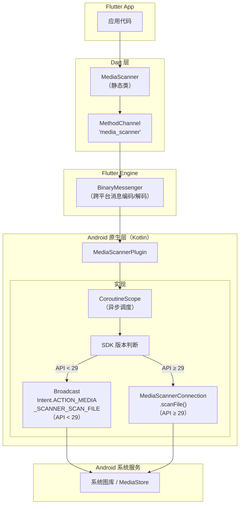
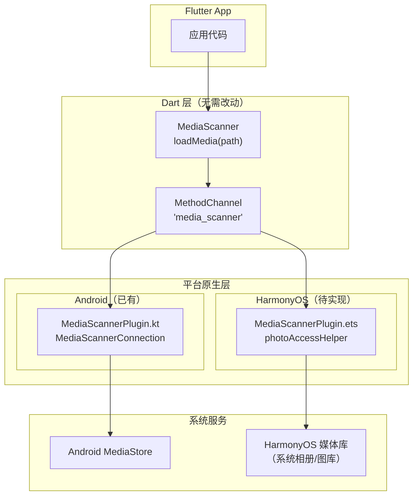
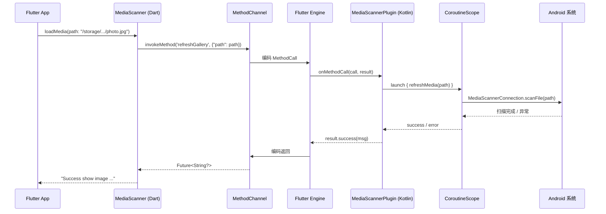
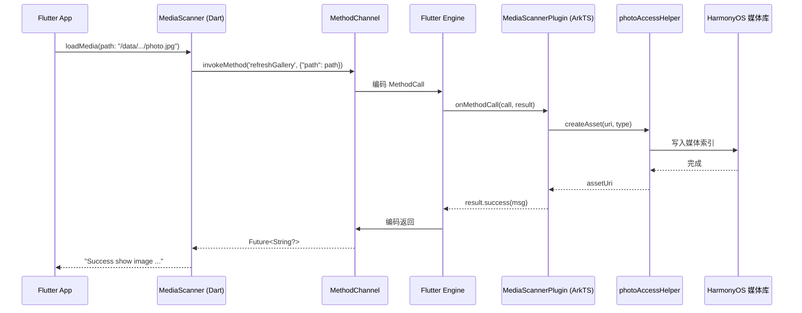
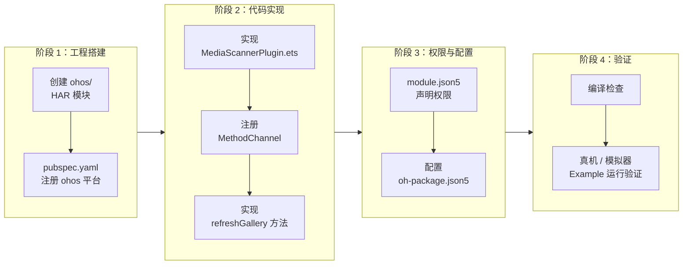
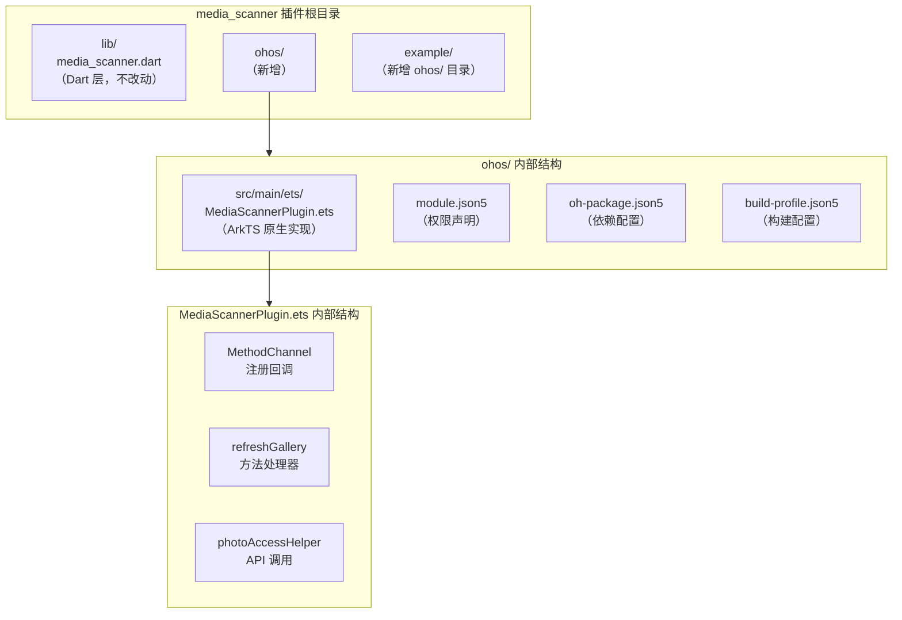
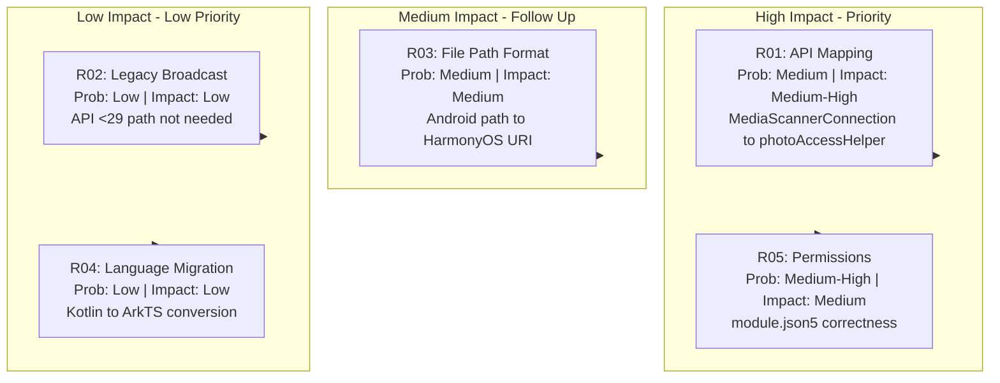
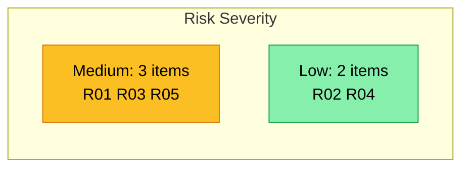
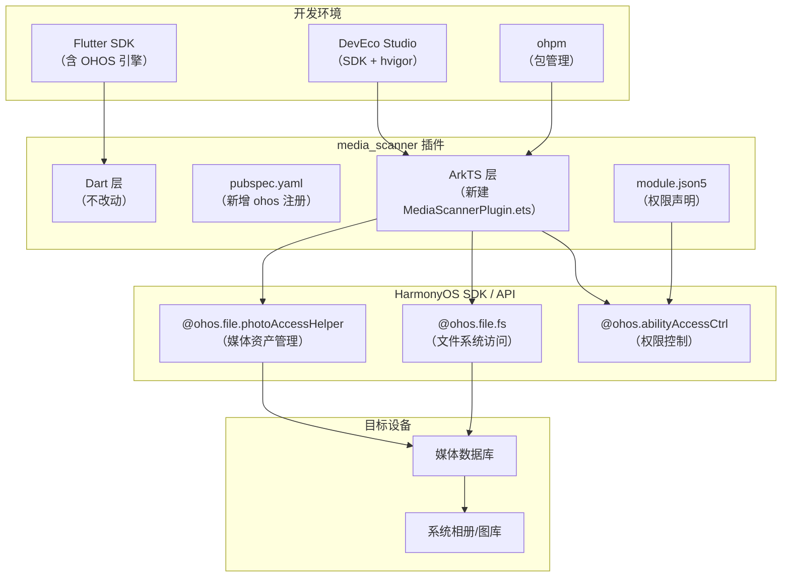

# media_scanner 鸿蒙适配 PRD

## 1. 插件概述

| 属性 | 值 |
|------|-----|
| 插件名 | `media_scanner` |
| 版本 | 2.2.1 |
| 类型 | MethodChannel 插件（standalone） |
| 原始平台 | Android Only |
| 适配目标 | HarmonyOS NEXT (OpenHarmony) |

**核心功能**：应用保存图片/视频后，通过系统媒体扫描服务刷新媒体库，使新文件在图库中可见，无需重启设备。

### 1.1 插件整体架构（当前 Android）



### 1.2 适配后目标架构（Android + HarmonyOS）



---

## 2. 能力清单

### F-01: 触发媒体库扫描

- **公开 API**：`MediaScanner.loadMedia({String? path})`
- **输入条件**：传入一个有效的文件绝对路径字符串
- **用户可见行为**：调用后图库 / 系统相册中能立即看到新保存的图片或视频
- **输出结果**：成功返回 `"Success show image {path} in Gallery"` 字符串；失败返回异常信息字符串
- **平台能力依赖**：
  - Android：`MediaScannerConnection.scanFile()`（API ≥29）或 `Intent.ACTION_MEDIA_SCANNER_SCAN_FILE` 广播（API <29）
  - HarmonyOS：`@ohos.file.photoAccessHelper` 创建媒体资产并写入文件数据，系统自动完成索引
- **适配风险**：【R01】【R02】HarmonyOS 没有与 Android `MediaScannerConnection` 完全等价的 API，但提供了功能等价的媒体资产管理能力

### 2.1 调用流程

#### 当前 Android 调用时序



#### HarmonyOS 适配后调用时序



---

## 3. 架构分析

### 3.1 Dart 层（lib/media_scanner.dart）

- 单一类 `MediaScanner`
- 静态 `MethodChannel('media_scanner')` 
- 仅 1 个方法：`loadMedia({String? path})` → `Future<String?>`
- 通过 `_channel.invokeMethod('refreshGallery', {"path": path})` 调用原生

### 3.2 Android 原生层（Kotlin）

- `MediaScannerPlugin` 实现 `FlutterPlugin` + `MethodCallHandler`
- 处理 `refreshGallery` 方法调用
- 使用 Kotlin Coroutines (`Dispatchers.Default`) 异步执行
- 版本分叉：API < 29 用广播，≥29 用 `MediaScannerConnection.scanFile()`
- 依赖：`kotlin-stdlib` + `kotlinx-coroutines`

### 3.3 平台注册

`pubspec.yaml` 仅注册 Android 平台：
```yaml
plugin:
  platforms:
    android:
      package: com.lazycatlabs.media_scanner
      pluginClass: MediaScannerPlugin
```

---

## 4. HarmonyOS 适配方案

### 4.1 插件类型判断

`plugin_type = "plugin_method_channel"`，需按照 MethodChannel 插件适配模式创建 `ohos/` 工程。

### 4.2 核心 API 映射

| Android API | HarmonyOS 等价方案 |
|------------|------------------|
| `MediaScannerConnection.scanFile(context, paths, mimeTypes, callback)` | `photoAccessHelper.MediaAssetChangeRequest.createAsset(context, fileUri)` 或直接通过 `file.fs` 写入公共媒体目录 |
| `Intent(Intent.ACTION_MEDIA_SCANNER_SCAN_FILE, Uri.fromFile(file))` + `sendBroadcast()` | 不适用 — HarmonyOS 无此机制；仅需关注当前 API 路径 |
| 文件路径 `File(path)` | HarmonyOS 使用 `fileUri`（URI 格式） / `file.fs` 获取文件访问能力 |

### 4.3 权限需求

HarmonyOS 需要以下权限（在 `ohos/module.json5` 中声明）：

| 权限 | 用途 |
|------|------|
| `ohos.permission.WRITE_MEDIA` | 写入媒体文件到公共媒体目录 |
| `ohos.permission.READ_MEDIA` | 读取媒体文件（如需校验） |
| `ohos.permission.FILE_ACCESS` | 访问用户文件系统（如使用 fileAccess 机制） |

### 4.4 适配步骤摘要



### 4.5 HarmonyOS 适配后模块结构



### 4.6 复杂度评估

| 维度 | 评估 |
|------|------|
| 复杂度等级 | **低** |
| Dart 层改动 | 无需改动（纯 MethodChannel，平台无关） |
| 原生层行数 | ~50-80 行 ArkTS |
| 依赖数量 | 0 个第三方库（仅 HarmonyOS SDK Kit） |
| 测试难度 | 低 — 需在真机/模拟器上触发媒体扫描 |
| 建议 | **proceed（可直接开始适配）** |

---

## 5. 判定依据

### 5.1 为什么复杂度为"低"

1. **代码量极小**：Dart 层仅 13 行，Android 层仅 75 行
2. **单一 API**：只有 1 个 MethodChannel + 1 个方法
3. **无状态**：无复杂状态管理，无 UI，无 Stream
4. **无第三方 Flutter 依赖**：不涉及依赖库适配问题
5. **无 FFI**：纯 MethodChannel 通信
6. **HarmonyOS 有等价能力**：`photoAccessHelper` 提供完整的媒体资产管理 API

### 5.2 为什么建议"proceed"

- 适配门槛极低，仅需实现一个 ArkTS 文件
- 核心逻辑（触发系统扫描文件并在图库中可见）在 HarmonyOS 上有成熟的 API 支持
- 无阻塞性风险 — 所有风险项（API 映射、路径格式、权限声明）均有明确解决方案

---

## 6. 风险汇总

### 6.1 风险全景图





### 6.2 风险清单

| ID | 风险 | 严重度 | 缓解措施 |
|----|------|--------|---------|
| R01 | `MediaScannerConnection.scanFile` → `photoAccessHelper` API 语义不完全对等 | 🟡 中 | 使用 `createAsset` 创建媒体资产，系统自动刷新；需在真机验证图库刷新行为 |
| R02 | 旧版 Android 广播路径在 HarmonyOS 无等价方案 | 🟢 低 | 忽略旧路径，HarmonyOS 设备 API level 足够高 |
| R03 | 文件路径格式平台差异 | 🟡 中 | 适配时统一使用 HarmonyOS 文件 URI 规范 |
| R04 | Kotlin → ArkTS 语言迁移 | 🟢 低 | 逻辑简单，async/await 直接替代 Coroutines |
| R05 | 权限声明不完整可能导致媒体写入失败 | 🟡 中 | 在 module.json5 中准确声明 WRITE_MEDIA / READ_MEDIA |

### 6.3 环境依赖与组件交互全景


