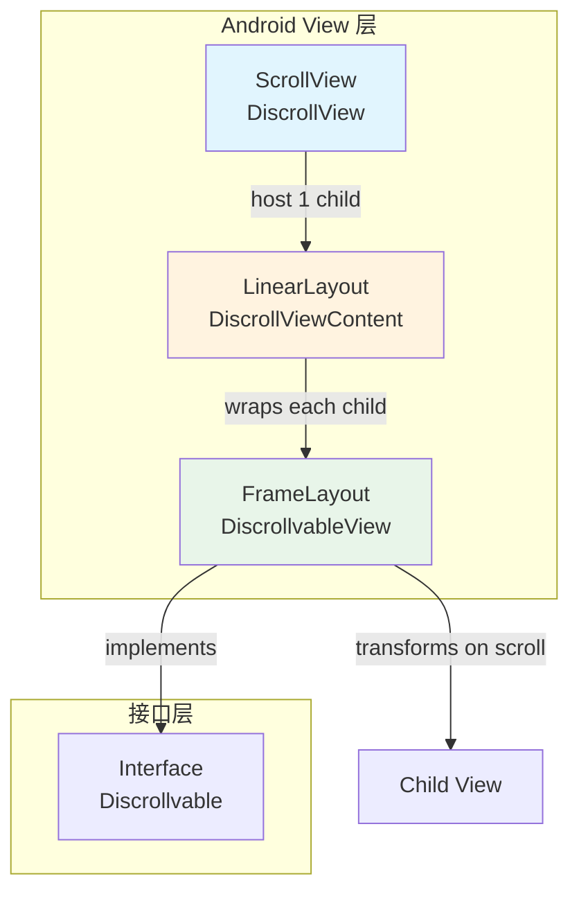
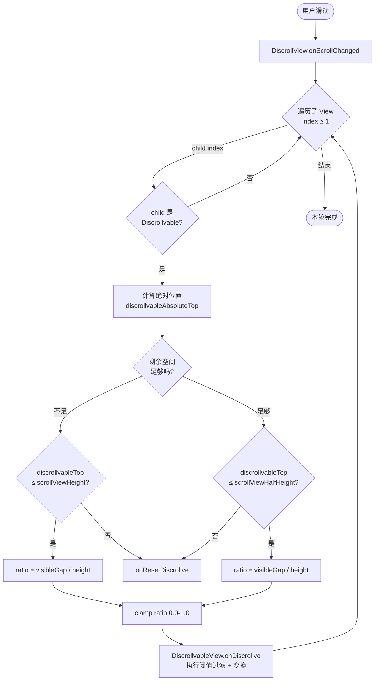
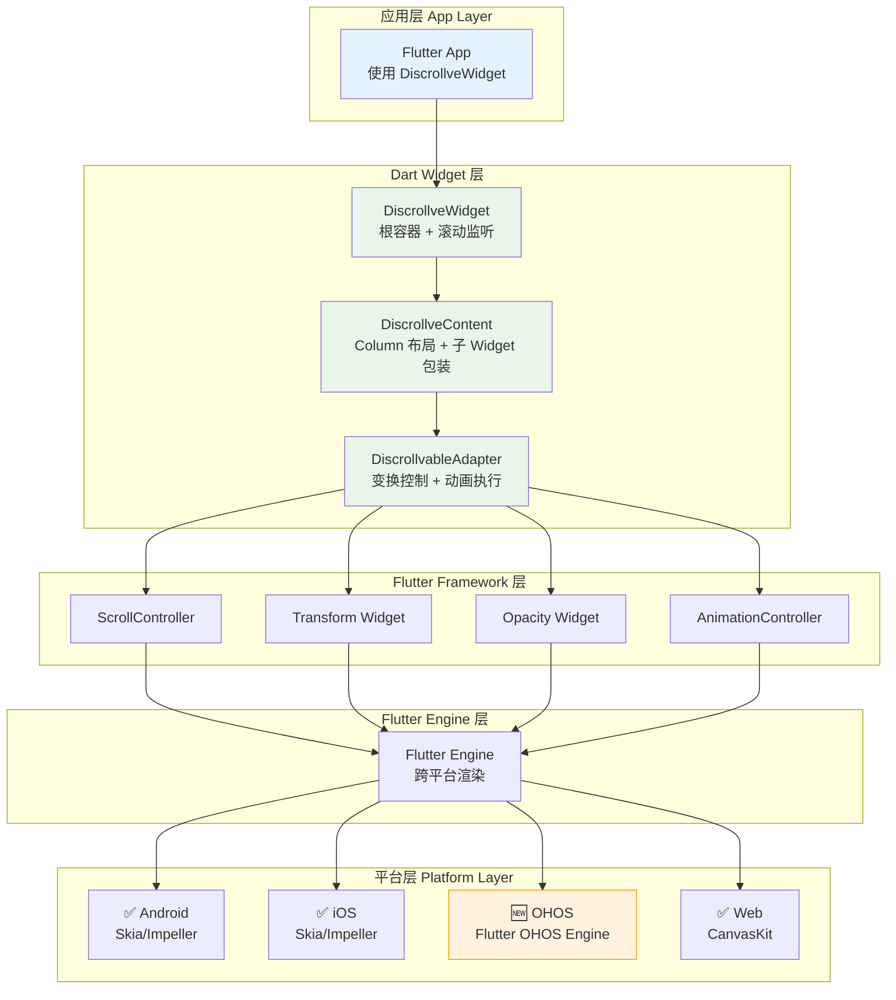
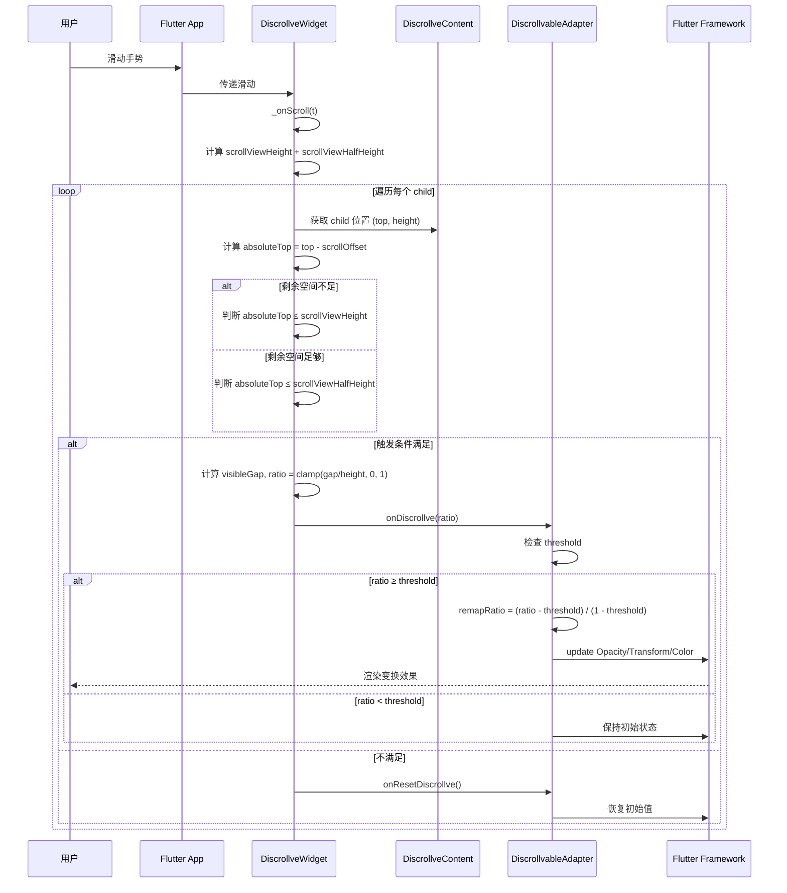
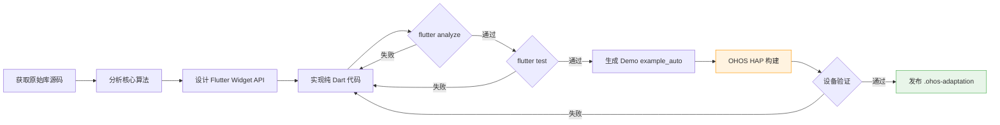

# Discrollview Flutter 鸿蒙化适配 PRD

**文档版本**: v1.0
**生成日期**: 2026-07-30
**项目名称**: discrollview 鸿蒙化适配

---

## 第一章 项目概述

### 1.1 项目背景

Discrollview 是 Flavien Laurent 开发的一个 Android 原生滚动视差动画库（GitHub: [flavienlaurent/discrollview](https://github.com/flavienlaurent/discrollview)），发布在 Maven Central（`com.github.flavienlaurent.discrollview:library:0.0.2@aar`）。该库扩展了 Android `ScrollView`，在用户滚动时为每个子视图提供基于滚动位置的变换（透明度/缩放/平移/背景色渐变），创造出"元素从无到有浮入画面"的视差滚动效果——作者称之为 Discrollve 模式。

由于该库是纯 Android 原生库（Java + Android View 体系），无法直接在 Flutter 生态或 OpenHarmony/OHOS 平台使用。本项目目标为：基于该库的核心交互模式，设计并实现一个**纯 Dart Flutter Widget**，使其可在 Flutter 多平台运行，并完成 OHOS 平台的适配验证。

### 1.2 项目目标

| 目标 | 说明 |
|------|------|
| 核心交付 | 纯 Dart Flutter Widget 库，提供 Discrollve 视差滚动效果 |
| API 设计 | 声明式 Flutter Widget API，支持 fade/scale/translation/bgColor 四种变换 + threshold |
| 平台支持 | Android / iOS / Web / OHOS（通过 Flutter 跨平台能力） |
| 鸿蒙验证 | 在 OHOS 真实设备上构建签名 HAP 并完成 L0-L3 级别黑盒测试用例 |
| 交付物 | `.ohos-adaptation/` 完整产物（分析/规划/编码/测试/Demo/HAP） |

### 1.3 插件概述

Discrollview 是一个**纯 Dart Flutter Widget 库**，将 Android 原生 Discrollview 视差滚动交互模式移植到 Flutter 多平台（Android / iOS / Web / OHOS）。核心组件为 `DiscrollveWidget`（根滚动容器，内部使用 `ScrollController` 监听滚动）、`DiscrollveContent`（子内容包装，`DiscrollveContent.child()` 静态工厂创建带变换配置的子项）与 `DiscrollveConfig`（不可变变换配置类）。插件零 MethodChannel、零 FFI、零原生依赖，`flutter.plugin.platforms = {}`，通过 pub 声明式集成，在 OHOS 上无需任何原生 HAR。

### 1.4 功能需求总览

| 需求 | 说明 | 关联模块 |
|------|------|----------|
| 滚动驱动变换 | 滚动位置映射为子 Widget 变换比例 ratio（0.0-1.0） | F-01 / F-05 |
| 6 种变换 | alpha / scaleX / scaleY / translation（4 方向）/ 背景色渐变 / 阈值延迟 | F-03 / F-06 / F-07 |
| 首屏静态头部 | 第一个子 Widget 占据 viewport 全高，不参与变换 | F-01 |
| 声明式配置 | 通过 `DiscrollveConfig` 逐子项声明变换参数，const 构造 + assert 校验 | F-03 |
| 重置恢复 | 子 Widget 滚出可视区或未达触发条件时恢复初始状态 | F-08 |

---

## 第二章 原始库分析

### 2.1 原始 Discrollview 架构（Android）

原始 Android 库由 4 个 Java 类组成：



### 2.2 核心类职责

| 类 | 父类 | 职责 |
|----|------|------|
| `DiscrollView` | `ScrollView` | 根容器，监听滚动事件，遍历子视图计算 ratio 并调用 `onDiscrollve()` |
| `DiscrollViewContent` | `LinearLayout(VERTICAL)` | 内容容器，自动将需要 discrollve 的子视图包装为 `DiscrollvableView` |
| `DiscrollvableView` | `FrameLayout` | 变换执行器，实现 `Discrollvable` 接口，根据 ratio 执行 alpha/scale/translation/bgColor |
| `Discrollvable` | `interface` | 定义 `onDiscrollve(float ratio)` 和 `onResetDiscrollve()` |

### 2.3 滚动变换算法



### 2.4 支持的变换类型

原始库通过 XML 自定义属性支持 6 种变换，`DiscrollvableView` 在 Java 端实现实际矩阵变换：

| 变换属性 | Android XML 属性 | 效果 |
|----------|-----------------|------|
| Alpha（透明度） | `discrollve:discrollve_alpha="true"` | 从 0.0 → 1.0 淡入 |
| Scale X（水平缩放） | `discrollve:discrollve_scaleX="true"` | 从 0.0 → 1.0 水平展开 |
| Scale Y（垂直缩放） | `discrollve:discrollve_scaleY="true"` | 从 0.0 → 1.0 垂直展开 |
| Translation（平移） | `discrollve:discrollve_translation="fromLeft\|fromBottom"` | 从指定方向移入原位 |
| Background Color（背景色） | `discrollve:discrollve_fromBgColor="#88EE66"` / `discrollve:discrollve_toBgColor="#000000"` | 背景色渐变过渡 |
| Threshold（阈值） | `discrollve:discrollve_threshold="0.3"` | 延迟触发，ratio < threshold 不执行变换 |

**Translation 方向**（位掩码，禁止对立方向同时使用）：
- `fromTop` (0x01)：从上方移入
- `fromBottom` (0x02)：从下方移入
- `fromLeft` (0x04)：从左方移入
- `fromRight` (0x08)：从右方移入
- 禁止组合：fromTop+fromBottom、fromLeft+fromRight

---

## 第三章 Flutter 适配设计

### 3.1 适配策略

| 维度 | 决策 |
|------|------|
| 实现路径 | **pure_dart** — 纯 Dart Flutter Widget，零原生代码 |
| 滚动基础 | Flutter `ScrollController` + `NotificationListener<ScrollNotification>` |
| 变换基础 | Flutter `Transform.scale` / `Transform.translate` / `Opacity` / `AnimatedContainer` |
| OHOS 兼容 | 使用 `defaultTargetPlatform == TargetPlatform.ohos` 仅在必要时分支（预期零分支） |
| 原生 HAR | 不需要 — 纯 Dart 路径 |

### 3.2 目标架构



### 3.3 与原始 Android 实现的差异

| 原始 Android | Flutter 适配 |
|-------------|-------------|
| `ScrollView` + XML 布局 | `NotificationListener<ScrollNotification>` + Widget 树 |
| `DiscrollViewContent.addView()` 自动包装 | 构建时通过 `DiscrollveContent` 参数声明 |
| 运行时 `onScrollChanged()` 遍历子 View | `ScrollController.addListener()` + `setState()` |
| `DiscrollvableView` 直接修改 View 属性 | 通过 `Transform`/`Opacity`/`AnimatedContainer` 声明式重建 |
| XML 自定义属性声明变换 | Dart 类 `DiscrollveConfig` 声明式配置 |
| `ArgbEvaluator` 颜色插值 | `Color.lerp()` |

---

## 第四章 模块设计

### 4.1 功能模块一览

| 模块编号 | 功能名称 | 描述 | 优先级 |
|----------|----------|------|--------|
| F-01 | DiscrollveWidget | 根滚动容器，提供 `ScrollController` 驱动，监听滚动位置并分发给子 Widget | P0 |
| F-02 | DiscrollveContent | 内容布局容器，纵向排列子 Widget，每个子 Widget 可独立配置 Discrollve 变换 | P0 |
| F-03 | DiscrollveConfig | 变换配置类，声明 alpha/scaleX/scaleY/translation/fromColor/toColor/threshold | P0 |
| F-04 | DiscrollveDirection | Translation 方向枚举：fromTop/fromBottom/fromLeft/fromRight | P1 |
| F-05 | 滚动比例计算 | 基于原始算法计算每个子 Widget 的 ratio（0.0-1.0），处理视图大小不足的情况 | P0 |
| F-06 | 变换渲染 | 根据 ratio + config 应用 transform/opacity/color 到子 Widget | P0 |
| F-07 | 阈值控制 | ratio < threshold 时不触发变换，使用 `withThreshold()` 重映射 ratio | P1 |
| F-08 | 重置/恢复 | 子 Widget 滚出可视区时恢复初始状态（`onResetDiscrollve`） | P0 |

### 4.2 模块交互时序



---

## 第五章 API 设计

### 5.1 Widget API

```dart
/// 根滚动容器，提供 Discrollve 视差滚动效果
///
/// 用法:
/// ```dart
/// DiscrollveWidget(
///   children: [
///     // 第一个 child 始终是静态头部（占据全屏高度）
///     DiscrollveContent.child(
///       config: DiscrollveConfig.none,  // 无变换
///       child: HeaderWidget(),
///     ),
///     DiscrollveContent.child(
///       config: DiscrollveConfig(
///         alpha: true,
///         translation: DiscrollveDirection.fromBottom | DiscrollveDirection.fromLeft,
///         threshold: 0.3,
///       ),
///       child: AnimatedItem(),
///     ),
///   ],
/// )
/// ```
class DiscrollveWidget extends StatefulWidget {
  /// 所有子 Widget，第一个为静态头部
  final List<DiscrollveContent> children;

  /// 外部可选的 ScrollController
  final ScrollController? controller;

  /// 滚动方向，默认垂直
  final Axis scrollDirection;
}

/// 内容包装 Widget
///
/// 使用静态工厂方法创建：
/// - [DiscrollveContent.child]: 单个子 Widget 带变换配置
class DiscrollveContent extends StatelessWidget {
  /// 子 Widget
  final Widget child;

  /// 变换配置
  final DiscrollveConfig config;

  /// 创建一个带 Discrollve 变换的子 Widget
  const DiscrollveContent.child({
    required this.child,
    this.config = DiscrollveConfig.none,
  });
}
```

### 5.2 配置类 API

```dart
/// Discrollve 变换配置
class DiscrollveConfig {
  /// 无变换的默认配置
  static const DiscrollveConfig none = DiscrollveConfig();

  /// 是否启用透明度变化 (0.0 → 1.0 淡入)
  final bool alpha;

  /// 是否启用水平缩放 (0.0 → 1.0)
  final bool scaleX;

  /// 是否启用垂直缩放 (0.0 → 1.0)
  final bool scaleY;

  /// 平移方向位掩码，默认 -1 表示不启用
  final int translation;

  /// 渐变起始颜色，默认 -1 表示不启用
  final int fromColor;

  /// 渐变目标颜色，默认 -1 表示不启用
  final int toColor;

  /// 阈值 [0.0, 1.0]，默认 0.0（立即触发）
  final double threshold;
}
```

### 5.3 辅助类 API

```dart
/// Translation 方向枚举
class DiscrollveDirection {
  static const int fromTop = 0x01;
  static const int fromBottom = 0x02;
  static const int fromLeft = 0x04;
  static const int fromRight = 0x08;
}
```

**API 总数**: 3 个 Widget（DiscrollveWidget / DiscrollveContent）+ 2 个配置类 + 1 个枚举类 = 6 个公开类

### 5.4 公开 API 规格

| 公开符号 | 类型 | 文件 | 职责 |
|----------|------|------|------|
| `DiscrollveWidget` | StatefulWidget | `lib/discrollve_widget.dart` | 根滚动容器：`children`（必填，≥2）、`controller?`、`scrollDirection`（默认 vertical）、`physics?` |
| `DiscrollveContent.child` | 静态工厂 | `lib/discrollve_widget.dart` | 创建带变换配置的子项：`child`（必填）、`config`（默认 `DiscrollveConfig.none`） |
| `DiscrollveConfig` | 不可变配置 | `lib/discrollve_config.dart` | 七种参数：alpha/scaleX/scaleY/translation/fromColor/toColor/threshold |
| `DiscrollveDirection` | 常量类 | `lib/discrollve_config.dart` | 位掩码：fromTop 0x01 / fromBottom 0x02 / fromLeft 0x04 / fromRight 0x08 |
| `clampRatio` | 顶层函数 | `lib/discrollve_math.dart` | 比例裁剪到 [min, max] |
| `withThreshold` | 顶层函数 | `lib/discrollve_math.dart` | 阈值重映射 [threshold,1.0] → [0.0,1.0] |
| `calculateRatio` | 顶层函数 | `lib/discrollve_math.dart` | 双触发模式 ratio 计算（center-reach / top-reach） |

### 5.5 错误处理规格

| 触发条件 | 行为 | 处理方式 |
|----------|------|----------|
| `children.length < 2` | 构造断言失败 | `assert` 抛出断言错误，提示至少需要头部 + 1 个子项 |
| threshold 超出 [0.0, 1.0] | 构造断言失败 | `assert` 运行期检查（debug 模式生效） |
| fromTop+fromBottom 或 fromLeft+fromRight 同时设置 | 构造断言失败 | `assert` 禁止对立方向组合 |
| 子 Widget 高度为 0 / 不可见 | ratio 计算返回 null | 保持重置状态，不执行变换，避免除零 |
| 外部 controller 已绑定其他滚动视图 | 共享监听 | 库不销毁外部 controller（仅 addListener/removeListener 配对） |

---

## 第六章 鸿蒙适配策略

### 6.1 纯 Dart 判定依据

| 检查项 | 结论 |
|--------|------|
| 是否使用 MethodChannel？ | 否 — 纯 UI Widget，无原生调用 |
| 是否使用 FFI？ | 否 — 无 C/C++ 依赖 |
| 是否依赖原生权限？ | 否 — 无文件/网络/传感器访问 |
| 是否使用 `dart:io`？ | 否 — 仅使用 Flutter Framework API |
| Flutter Framework API 在 OHOS 上可用？ | 是 — `ScrollController`/`Transform`/`Opacity`/`AnimationController` 均为跨平台 API |

**结论**：纯 Dart 路径，零原生代码适配。仅需在 `pubspec.yaml` 中声明 OHOS 平台支持。

### 6.2 可能的平台特定处理

根据 `flutter_zoom_drawer` 案例经验，以下位置可能需要 OHOS 条件分支：

| 场景 | 处理方式 |
|------|----------|
| 返回导航（PopScope） | 无需额外处理 — DiscrollveWidget 不涉及导航 |
| `Platform.isOhos` 判断 | 预期不需要 — 所有使用的 Flutter API 均为跨平台 API |
| `defaultTargetPlatform` | 预期不需要 — 无 Android/iOS 特定行为分支 |

### 6.3 适配流程图



### 6.4 适配要点提示和平台差异对照

| 平台 | 滚动容器 | 变换执行 | 差异提示 |
|------|----------|----------|----------|
| Android | `ScrollView` + XML 属性 | `DiscrollvableView.onDiscrollve()` 直接改 View 属性 | 原始 Android 在运行时遍历子 View |
| Flutter 多平台 | `ScrollController` + `NotificationListener` | `Transform` / `Opacity` / `Color.lerp` 声明式重建 | 无差异——库不依赖任何平台特定行为 |
| OHOS | Flutter OHOS Engine 提供相同 Framework API | 与 Flutter 一致 | **零条件分支**：`defaultTargetPlatform` / `Platform.isOhos` 均无需判断 |

**适配要点**：库为纯 Dart，唯一需要确认的是 OHOS 上 Flutter Framework 基础 API（`ScrollController`、`Transform`、`Opacity`、`Color.lerp`、`Matrix4`）可用性——经 `flutter_zoom_drawer` 案例验证，这些 API 在 Flutter OHOS 3.32.4-ohos-0.0.1 上全部可用。无需在 `pubspec.yaml` 注册任何原生平台。

---

## 第七章 兼容性分析

### 7.1 Flutter SDK 版本

| 平台 | 最低版本 | 备注 |
|------|----------|------|
| Flutter SDK | 3.22+ | `ScrollController` + `NotificationListener` 均为基础 API |
| Flutter OHOS | 3.22+ | 与 Flutter OHOS SDK 对应版本 |
| Dart SDK | 3.4+ | 使用 Dart 3 特性（records, patterns 可选） |

### 7.2 设备兼容性

| 设备款型 | 兼容性 | 说明 |
|----------|--------|------|
| 直板高端 | ✅ 完全兼容 | 滚动性能流畅，60fps 动画 |
| 直板中低端 | ⚠️ 需验证 | 需确认低端设备 `setState` 触发重建性能 |
| 双折叠 | ✅ 完全兼容 | 依赖 Flutter 自适应布局 |
| 阔折叠 | ✅ 完全兼容 | 依赖 Flutter 自适应布局 |
| 2in1（平板/PC）| ✅ 完全兼容 | 大屏体验更优 |

### 7.3 API 版本兼容性

| HarmonyOS API | 兼容性 | 说明 |
|---------------|--------|------|
| API 19 | ✅ | 基础 Flutter OHOS 支持 |
| API 21 | ✅ | 同上 |
| API 22 | ✅ | 同上 |
| API 23 | ✅ | 同上（最新） |

---

## 第八章 风险评估

### 8.1 技术风险

| 风险 | 级别 | 说明 | 缓解措施 |
|------|------|------|----------|
| 滚动性能 | 🟡 中 | `setState` 每次滚动触发重建可能影响低端设备帧率 | 使用 `AnimatedBuilder` / `ValueListenableBuilder` 局部重建 |
| 大列表场景 | 🟡 中 | 子 Widget 过多时遍历计算开销 | 虚拟化/`ListView.builder` 集成方案 |
| Flutter OHOS Engine 兼容 | 🟢 低 | 使用的均为 Framework 层基础 API | OHOS SDK 已验证支持 |
| 首个子 Widget 高度适配 | 🟢 低 | 需处理首屏静态头部高度 | `LayoutBuilder` + `MediaQuery` |
| Translation 方向冲突 | 🟢 低 | fromTop+fromBottom 或 fromLeft+fromRight 不能同时使用 | assert 运行时检查 |

### 8.2 依赖风险

| 依赖 | 风险 | 说明 |
|------|------|------|
| Flutter Framework | 🟢 无 | 仅依赖 Framework 原生 Widget，零第三方依赖 |
| Flutter OHOS Engine | 🟢 低 | OHOS 版本已发布稳定版本 |

### 8.3 非功能性需求

| 类别 | 需求 | 验证方式 |
|------|------|----------|
| 性能 | 滚动时单帧变换计算开销可控，目标 60fps | 设备滚动实测 + DFX Dart 扫描（无重建热点） |
| 稳定性 | 滚动监听 addListener/removeListener 配对，无泄漏；外部 controller 不销毁 | 静态 DFX + widget 测试 |
| 兼容性 | Android / iOS / Web / OHOS 行为一致，零平台条件分支 | `flutter test` + OHOS HAP 设备验证 |
| 可维护性 | API 声明式、纯函数 ratio 计算可单测 | 单元测试覆盖率 |
| 可移植性 | 无 `dart:io`、无原生依赖，纯 pub 包 | 依赖清单 + 源码扫描 |

---

## 第九章 测试策略

### 9.1 测试层次

| 层次 | 类型 | 范围 | 数量（与评审用例集一致） |
|------|------|------|----------|
| L0 | 核心功能 | 滚动驱动 / alpha 变换 / scale 变换 / translation 变换 | 14 个 |
| L1 | 重要功能 | bgColor 变换 / threshold / 混合变换 / 方向验证 | 11 个 |
| L2 | 边界条件 | 空列表 / 单子 / 极值 ratio / 快速滚动 | 6 个 |
| **合计** | | | **31 个** |

### 9.2 测试类型分布

| 类型 | 覆盖范围 |
|------|----------|
| Widget 单元测试 | `DiscrollveWidget` 构建、`DiscrollveConfig` 参数校验、ratio 计算逻辑 |
| Widget 交互测试 | `ScrollController` 模拟滚动、变换值断言 |
| DFX 测试 | Dart 层滚动性能、动画帧率、内存泄漏 |
| OHOS 设备测试 | 真实 HAP 安装/启动/滚动/变换效果观察 |

### 9.3 自动化测试分析

由于 DiscrollveWidget 是纯 UI Widget：
- **可自动化**：ratio 计算逻辑（纯函数）、构建正确性、配置校验
- **需人工**：视觉效果验证（alpha/scale/translation 的正确性）
- **设备验证**：滚动流畅度、OHOS 平台渲染一致性

---

## 第十章 实施计划

### 10.1 阶段划分

| 阶段 | 任务 | 产出 | 预估工期 |
|------|------|------|----------|
| 1 | 源码分析 + PRD | `01-analysis-prd.md` | ✅ 已完成 |
| 2 | 详细分析 + 规划 | `01-analysis.json` / `02-planning.json` | 1d |
| 3 | 编码实现 | `lib/discrollve_widget.dart` 等 | 2d |
| 4 | 测试设计 + 用例 | `02-test-points.json` / `04-test-cases.json` | 1d |
| 5 | 测试实现 + 执行 | Widget/Unit Tests | 1d |
| 6 | Demo 生成 | `example_auto/` | 1d |
| 7 | OHOS HAP 构建 + 签名 | HAP 产物 | 1d（依赖设备） |
| 8 | 文档 + 交付 | `INTEGRATION_GUIDE.md` / `CHANGELOG.md` | 1d |

### 10.2 里程碑

| 里程碑 | 通过标准 |
|--------|----------|
| M1: 分析完成 | PRD + `01-analysis.json` 通过 AJV Schema 验证 |
| M2: 编码完成 | `flutter analyze` + `flutter test` 全通过 |
| M3: 测试完成 | 三方评审通过，评分 ≥ 80 |
| M4: Demo 完成 | `example_auto/` L0-L3 全部可用 |
| M5: HAP 完成 | 签名 HAP 安装启动成功 |

---

## 第十一章 交付物清单

### 11.1 `.ohos-adaptation/` 产物

```
.ohos-adaptation/
├── 00-migration-context.json
├── 00-source-scan.json
├── 00-requirement.json
├── 00-requirement-report.md
├── 01-analysis.json
├── 01-analysis-report.md
├── 01-analysis-prd.md          ← 本文件
├── discrollview_prd.md         ← 本文件的字节相同副本
├── 01-prd-mermaid-validation.json
├── mermaid/*.svg
├── 02-planning.json
├── 02-planning-report.md
├── 02-test-analysis-report.md
├── 02-test-points.json
├── 03-analysis-review-report.md
├── 03-analysis-review.json
├── 03-coding-library.json
├── 03-coding-library-report.md
├── 03-code-review.json
├── 04-test-cases.md
├── 04-test-cases.json
├── 05-case-review-report.md
├── 05-case-review.json
├── 05-test-cases.xlsx
├── 04-droidrun-test-cases.json
├── 04-droidrun-test-cases.md
├── 04-droidrun--agent-prompt.md
├── 04-droidrun--app-card.md
├── patch-manifest.json
├── patch-implementation-report.md
├── 04-testing.json
├── 04-testing-report.md
├── 04-verification-evidence.json
├── 05-demo-gen.json
├── 05-demo-gen-report.md
├── artifact-manifest.json
├── 05-summary.json
├── 05-summary-report.md
├── 05-schema-validation.json
├── 05-pipeline-consistency.json
├── INTEGRATION_GUIDE.md
└── logs/
```

### 11.2 源码产物

```
lib/
├── discrollve_widget.dart      # DiscrollveWidget + DiscrollveContent
├── discrollve_config.dart      # DiscrollveConfig + DiscrollveDirection
└── discrollve_math.dart        # ratio 计算 + clamp 工具函数
test/
├── discrollve_widget_test.dart
├── discrollve_config_test.dart
└── discrollve_math_test.dart
example_auto/
├── lib/
│   ├── main.dart
│   ├── app_keys.dart
│   ├── routes.dart
│   └── pages/
└── ohos/
    └── entry/
```

---

## 第十二章 完整性自检清单

### 12.1 需求覆盖

| 原始功能 | Flutter 对应 | 状态 |
|----------|-------------|------|
| DiscrollView 根滚动容器 | `DiscrollveWidget` | ✅ 设计完成 |
| DiscrollViewContent 内容布局 | `DiscrollveContent` | ✅ 设计完成 |
| Discrollvable 变换接口 | `DiscrollveConfig` 配置类 | ✅ 设计完成 |
| Alpha 透明度变换 | `config.alpha` + `Opacity` Widget | ✅ 设计完成 |
| ScaleX/ScaleY 缩放变换 | `config.scaleX/scaleY` + `Transform.scale` | ✅ 设计完成 |
| fromTop/fromBottom/fromLeft/fromRight | `DiscrollveDirection` 枚举 | ✅ 设计完成 |
| fromBgColor → toBgColor 背景渐变 | `config.fromColor/toColor` + `Color.lerp` | ✅ 设计完成 |
| Threshold 阈值延迟 | `config.threshold` + `withThreshold()` | ✅ 设计完成 |
| onResetDiscrollve 重置 | `ratio == 1.0` 时恢复初始值 | ✅ 设计完成 |
| 首个子 View 占满全屏高度 | `LayoutBuilder` + 首个 child 高度 = viewport 高度 | ✅ 设计完成 |
| fromTop+fromBottom / fromLeft+fromRight 互斥 | `assert` 运行时检查 | ✅ 设计完成 |

### 12.2 未覆盖项

无。原始库全部功能均已映射到 Flutter Widget 设计。

### 12.3 Mermaid 图表验证

| # | 图表 | 类型 | 位置 | 状态 |
|---|------|------|------|------|
| 1 | 原始 Android 架构图 | `graph TB` + `subgraph` | §2.1 | ✅ |
| 2 | 滚动变换算法流程图 | `flowchart TD` | §2.3 | ✅ |
| 3 | Flutter 目标架构图 | `graph TB` + `subgraph` | §3.2 | ✅ |
| 4 | 模块交互时序图 | `sequenceDiagram` | §4.2 | ✅ |
| 5 | 适配流程图 | `flowchart LR` | §6.3 | ✅ |

### 12.4 审计结论

- ✅ 12 章节结构完整（含插件概述 / 功能需求总览 / 公开 API 规格 / 错误处理规格 / 非功能性需求 / 适配要点提示和平台差异对照）
- ✅ ≥ 4 个 Mermaid 图表（共 5 个）
- ✅ 包含 `graph TB`（架构图）、`flowchart TD`（流程图）、`sequenceDiagram`（时序图）
- ✅ 中文撰写
- ✅ 公开 API 完整定义
- ✅ OHOS 适配策略明确（pure_dart 路径）
- ✅ 风险评估齐全
- ✅ 实施计划可执行

---

*本 PRD 由 flutter-fast 适配工作流生成 · 2026-07-30*
